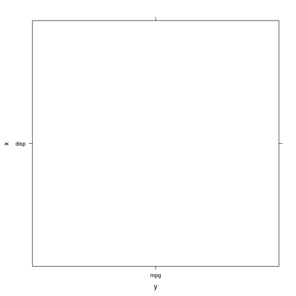

Evaluation - Hadley master class

========================================================

## Examine subset function

```r
subset(mtcars, cyl == 4)
```

```
##                 mpg cyl  disp  hp drat    wt  qsec vs am gear carb
## Datsun 710     22.8   4 108.0  93 3.85 2.320 18.61  1  1    4    1
## Merc 240D      24.4   4 146.7  62 3.69 3.190 20.00  1  0    4    2
## Merc 230       22.8   4 140.8  95 3.92 3.150 22.90  1  0    4    2
## Fiat 128       32.4   4  78.7  66 4.08 2.200 19.47  1  1    4    1
## Honda Civic    30.4   4  75.7  52 4.93 1.615 18.52  1  1    4    2
## Toyota Corolla 33.9   4  71.1  65 4.22 1.835 19.90  1  1    4    1
## Toyota Corona  21.5   4 120.1  97 3.70 2.465 20.01  1  0    3    1
## Fiat X1-9      27.3   4  79.0  66 4.08 1.935 18.90  1  1    4    1
## Porsche 914-2  26.0   4 120.3  91 4.43 2.140 16.70  0  1    5    2
## Lotus Europa   30.4   4  95.1 113 3.77 1.513 16.90  1  1    5    2
## Volvo 142E     21.4   4 121.0 109 4.11 2.780 18.60  1  1    4    2
```

```r
# vs.
mtcars[mtcars$cyl == 4, ]
```

```
##                 mpg cyl  disp  hp drat    wt  qsec vs am gear carb
## Datsun 710     22.8   4 108.0  93 3.85 2.320 18.61  1  1    4    1
## Merc 240D      24.4   4 146.7  62 3.69 3.190 20.00  1  0    4    2
## Merc 230       22.8   4 140.8  95 3.92 3.150 22.90  1  0    4    2
## Fiat 128       32.4   4  78.7  66 4.08 2.200 19.47  1  1    4    1
## Honda Civic    30.4   4  75.7  52 4.93 1.615 18.52  1  1    4    2
## Toyota Corolla 33.9   4  71.1  65 4.22 1.835 19.90  1  1    4    1
## Toyota Corona  21.5   4 120.1  97 3.70 2.465 20.01  1  0    3    1
## Fiat X1-9      27.3   4  79.0  66 4.08 1.935 18.90  1  1    4    1
## Porsche 914-2  26.0   4 120.3  91 4.43 2.140 16.70  0  1    5    2
## Lotus Europa   30.4   4  95.1 113 3.77 1.513 16.90  1  1    5    2
## Volvo 142E     21.4   4 121.0 109 4.11 2.780 18.60  1  1    4    2
```

```r
# How does it work?
subset <- function(x, condition) {
    condition_call <- substitute(condition)
    r <- eval(condition_call, x, parent.frame())
    x[r, ]
}
condition_call <- substitute(cyl == 4)
r <- eval(condition_call, mtcars, parent.frame())
mtcars[r, ]
```

```
##                 mpg cyl  disp  hp drat    wt  qsec vs am gear carb
## Datsun 710     22.8   4 108.0  93 3.85 2.320 18.61  1  1    4    1
## Merc 240D      24.4   4 146.7  62 3.69 3.190 20.00  1  0    4    2
## Merc 230       22.8   4 140.8  95 3.92 3.150 22.90  1  0    4    2
## Fiat 128       32.4   4  78.7  66 4.08 2.200 19.47  1  1    4    1
## Honda Civic    30.4   4  75.7  52 4.93 1.615 18.52  1  1    4    2
## Toyota Corolla 33.9   4  71.1  65 4.22 1.835 19.90  1  1    4    1
## Toyota Corona  21.5   4 120.1  97 3.70 2.465 20.01  1  0    3    1
## Fiat X1-9      27.3   4  79.0  66 4.08 1.935 18.90  1  1    4    1
## Porsche 914-2  26.0   4 120.3  91 4.43 2.140 16.70  0  1    5    2
## Lotus Europa   30.4   4  95.1 113 3.77 1.513 16.90  1  1    5    2
## Volvo 142E     21.4   4 121.0 109 4.11 2.780 18.60  1  1    4    2
```


## Quoting

```r
x <- quote(vs == am)
x
```

```
## vs == am
```

```r
# vs == am
str(x)
```

```
##  language vs == am
```

```r
# language vs == am
is.language(x)
```

```
## [1] TRUE
```

```r
# [1] TRUE
is.call(x)
```

```
## [1] TRUE
```

```r
# [1] TRUE
is.expression(x)
```

```
## [1] FALSE
```

```r
# [1] FALSE

call("==", "vs", "am")
```

```
## "vs" == "am"
```

```r
call("==", vs, am)
```

```
## Error: object 'vs' not found
```

```r
call("==", as.name("vs"), as.name("am"))
```

```
## vs == am
```

```r

x <- parse(text = "vs == am")
x
```

```
## expression(vs == am)
```

```r
is.expression(x)
```

```
## [1] TRUE
```

```r
# [1] TRUE Expressions are a list of calls/symbols
x[[1]]
```

```
## vs == am
```

```r
# vs == am
is.call(x[[1]])
```

```
## [1] TRUE
```

```r
# [1] TRUE
```


Why won't this work?

```r
subset2 <- function(x, condition) {
    quote(condition)
}
subset2(mtcars, cyl == 8)
```

```
## condition
```

```r
condition <- quote(cyl == 8)
condition
```

```
## cyl == 8
```

```r
condition <- substitute(cyl == 8)

```


Subset - cont'd

```r
subset <- function(x, condition) {
    match.call()
}
subset(mtcars, vs == am)
```

```
## subset(x = mtcars, condition = vs == am)
```

```r
# subset(x = mtcars, condition = vs == am)
subset <- function(x, condition) {
    match.call()$condition
}
subset(mtcars, vs == am)
```

```
## vs == am
```

```r
# subset(x = mtcars, condition = vs == am)

subset <- function(x, condition) {
    substitute(condition)
}
subset(mtcars, vs == am)
```

```
## vs == am
```

```r
# Uses lazy evaluation and extracts call from promise/thunk Also has other
# uses
```


## Evaluating
Evaluate in a data frame environment (not global environment)

```r
# Given a call and an environment (or something like an environment like a
# list or data frame), eval will evaluate the call in that environment
rm(list = ls())
x <- quote(vs == am)
eval(x, globalenv())
```

```
## Error: object 'vs' not found
```

```r
eval(x, mtcars)  # evaluates in mtcars environment! COOL!
```

```
##  [1] FALSE FALSE  TRUE FALSE  TRUE FALSE  TRUE FALSE FALSE FALSE FALSE
## [12]  TRUE  TRUE  TRUE  TRUE  TRUE  TRUE  TRUE  TRUE  TRUE FALSE  TRUE
## [23]  TRUE  TRUE  TRUE  TRUE FALSE  TRUE FALSE FALSE FALSE  TRUE
```

```r
# What will happen when I run this code?
eval(vs == am, mtcars)
```

```
## Error: object 'vs' not found
```

```r
eval(quote(vs == am), mtcars)
```

```
##  [1] FALSE FALSE  TRUE FALSE  TRUE FALSE  TRUE FALSE FALSE FALSE FALSE
## [12]  TRUE  TRUE  TRUE  TRUE  TRUE  TRUE  TRUE  TRUE  TRUE FALSE  TRUE
## [23]  TRUE  TRUE  TRUE  TRUE FALSE  TRUE FALSE FALSE FALSE  TRUE
```

```r

subset <- function(x, condition) {
    condition_call <- substitute(condition)
    r <- eval(condition_call, x)
    x[r, ]
}
subset(mtcars, cyl == 4)
```

```
##                 mpg cyl  disp  hp drat    wt  qsec vs am gear carb
## Datsun 710     22.8   4 108.0  93 3.85 2.320 18.61  1  1    4    1
## Merc 240D      24.4   4 146.7  62 3.69 3.190 20.00  1  0    4    2
## Merc 230       22.8   4 140.8  95 3.92 3.150 22.90  1  0    4    2
## Fiat 128       32.4   4  78.7  66 4.08 2.200 19.47  1  1    4    1
## Honda Civic    30.4   4  75.7  52 4.93 1.615 18.52  1  1    4    2
## Toyota Corolla 33.9   4  71.1  65 4.22 1.835 19.90  1  1    4    1
## Toyota Corona  21.5   4 120.1  97 3.70 2.465 20.01  1  0    3    1
## Fiat X1-9      27.3   4  79.0  66 4.08 1.935 18.90  1  1    4    1
## Porsche 914-2  26.0   4 120.3  91 4.43 2.140 16.70  0  1    5    2
## Lotus Europa   30.4   4  95.1 113 3.77 1.513 16.90  1  1    5    2
## Volvo 142E     21.4   4 121.0 109 4.11 2.780 18.60  1  1    4    2
```

```r
# It works!
```


## Scoping

```r
rm(list = ls())
# What should this do?
x <- 4
subset(mtcars, cyl == x)
```

```
##                 mpg cyl  disp  hp drat    wt  qsec vs am gear carb
## Datsun 710     22.8   4 108.0  93 3.85 2.320 18.61  1  1    4    1
## Merc 240D      24.4   4 146.7  62 3.69 3.190 20.00  1  0    4    2
## Merc 230       22.8   4 140.8  95 3.92 3.150 22.90  1  0    4    2
## Fiat 128       32.4   4  78.7  66 4.08 2.200 19.47  1  1    4    1
## Honda Civic    30.4   4  75.7  52 4.93 1.615 18.52  1  1    4    2
## Toyota Corolla 33.9   4  71.1  65 4.22 1.835 19.90  1  1    4    1
## Toyota Corona  21.5   4 120.1  97 3.70 2.465 20.01  1  0    3    1
## Fiat X1-9      27.3   4  79.0  66 4.08 1.935 18.90  1  1    4    1
## Porsche 914-2  26.0   4 120.3  91 4.43 2.140 16.70  0  1    5    2
## Lotus Europa   30.4   4  95.1 113 3.77 1.513 16.90  1  1    5    2
## Volvo 142E     21.4   4 121.0 109 4.11 2.780 18.60  1  1    4    2
```

```r
y <- 4
subset(mtcars, cyl == y)
```

```
##                 mpg cyl  disp  hp drat    wt  qsec vs am gear carb
## Datsun 710     22.8   4 108.0  93 3.85 2.320 18.61  1  1    4    1
## Merc 240D      24.4   4 146.7  62 3.69 3.190 20.00  1  0    4    2
## Merc 230       22.8   4 140.8  95 3.92 3.150 22.90  1  0    4    2
## Fiat 128       32.4   4  78.7  66 4.08 2.200 19.47  1  1    4    1
## Honda Civic    30.4   4  75.7  52 4.93 1.615 18.52  1  1    4    2
## Toyota Corolla 33.9   4  71.1  65 4.22 1.835 19.90  1  1    4    1
## Toyota Corona  21.5   4 120.1  97 3.70 2.465 20.01  1  0    3    1
## Fiat X1-9      27.3   4  79.0  66 4.08 1.935 18.90  1  1    4    1
## Porsche 914-2  26.0   4 120.3  91 4.43 2.140 16.70  0  1    5    2
## Lotus Europa   30.4   4  95.1 113 3.77 1.513 16.90  1  1    5    2
## Volvo 142E     21.4   4 121.0 109 4.11 2.780 18.60  1  1    4    2
```

```r
# What does it do?  Why?
```


```r
# We need to tell eval where to look if the variables aren't found in the
# data frame.  We need to provide the equivalent of a parent environment.
# That’s the third argument to eval
subset <- function(x, condition) {
    condition_call <- substitute(condition)
    r <- eval(condition_call, x, parent.frame())
    x[r, ]
}
# parent.frame() finds the environment in which the current function is
# being executed

x <- 4
f1 <- function() {
    x <- 6
    subset(mtcars, cyl == x)
}
f1()
```

```
##                 mpg cyl  disp  hp drat    wt  qsec vs am gear carb
## Mazda RX4      21.0   6 160.0 110 3.90 2.620 16.46  0  1    4    4
## Mazda RX4 Wag  21.0   6 160.0 110 3.90 2.875 17.02  0  1    4    4
## Hornet 4 Drive 21.4   6 258.0 110 3.08 3.215 19.44  1  0    3    1
## Valiant        18.1   6 225.0 105 2.76 3.460 20.22  1  0    3    1
## Merc 280       19.2   6 167.6 123 3.92 3.440 18.30  1  0    4    4
## Merc 280C      17.8   6 167.6 123 3.92 3.440 18.90  1  0    4    4
## Ferrari Dino   19.7   6 145.0 175 3.62 2.770 15.50  0  1    5    6
```

```r
f2 <- function() {
    x <- 8
    subset(mtcars, cyl == get("x"))
}
f2()
```

```
##                      mpg cyl  disp  hp drat    wt  qsec vs am gear carb
## Hornet Sportabout   18.7   8 360.0 175 3.15 3.440 17.02  0  0    3    2
## Duster 360          14.3   8 360.0 245 3.21 3.570 15.84  0  0    3    4
## Merc 450SE          16.4   8 275.8 180 3.07 4.070 17.40  0  0    3    3
## Merc 450SL          17.3   8 275.8 180 3.07 3.730 17.60  0  0    3    3
## Merc 450SLC         15.2   8 275.8 180 3.07 3.780 18.00  0  0    3    3
## Cadillac Fleetwood  10.4   8 472.0 205 2.93 5.250 17.98  0  0    3    4
## Lincoln Continental 10.4   8 460.0 215 3.00 5.424 17.82  0  0    3    4
## Chrysler Imperial   14.7   8 440.0 230 3.23 5.345 17.42  0  0    3    4
## Dodge Challenger    15.5   8 318.0 150 2.76 3.520 16.87  0  0    3    2
## AMC Javelin         15.2   8 304.0 150 3.15 3.435 17.30  0  0    3    2
## Camaro Z28          13.3   8 350.0 245 3.73 3.840 15.41  0  0    3    4
## Pontiac Firebird    19.2   8 400.0 175 3.08 3.845 17.05  0  0    3    2
## Ford Pantera L      15.8   8 351.0 264 4.22 3.170 14.50  0  1    5    4
## Maserati Bora       15.0   8 301.0 335 3.54 3.570 14.60  0  1    5    8
```


```r
# An alternative approach would be to use a formula Formulas quote and
# capture the environment in which they are defined
subset <- function(x, f) {
    r <- eval(f[[2]], x, environment(f))
    x[r, ]
}
subset(mtcars, ~cyl == x)
```

```
##                 mpg cyl  disp  hp drat    wt  qsec vs am gear carb
## Datsun 710     22.8   4 108.0  93 3.85 2.320 18.61  1  1    4    1
## Merc 240D      24.4   4 146.7  62 3.69 3.190 20.00  1  0    4    2
## Merc 230       22.8   4 140.8  95 3.92 3.150 22.90  1  0    4    2
## Fiat 128       32.4   4  78.7  66 4.08 2.200 19.47  1  1    4    1
## Honda Civic    30.4   4  75.7  52 4.93 1.615 18.52  1  1    4    2
## Toyota Corolla 33.9   4  71.1  65 4.22 1.835 19.90  1  1    4    1
## Toyota Corona  21.5   4 120.1  97 3.70 2.465 20.01  1  0    3    1
## Fiat X1-9      27.3   4  79.0  66 4.08 1.935 18.90  1  1    4    1
## Porsche 914-2  26.0   4 120.3  91 4.43 2.140 16.70  0  1    5    2
## Lotus Europa   30.4   4  95.1 113 3.77 1.513 16.90  1  1    5    2
## Volvo 142E     21.4   4 121.0 109 4.11 2.780 18.60  1  1    4    2
```

```r
# Using formulas has the advantage that it's very obvious that something
# non-standard is going on
```


## Good for interactive, but not programming

```r
# All these functions are useful for interactive data analysis, but ARE NOT
# suitable for programming with.
rm(list = ls())
scramble <- function(x) x[sample(nrow(x)), ]
scramble(mtcars)
```

```
##                      mpg cyl  disp  hp drat    wt  qsec vs am gear carb
## Duster 360          14.3   8 360.0 245 3.21 3.570 15.84  0  0    3    4
## Valiant             18.1   6 225.0 105 2.76 3.460 20.22  1  0    3    1
## Lotus Europa        30.4   4  95.1 113 3.77 1.513 16.90  1  1    5    2
## Pontiac Firebird    19.2   8 400.0 175 3.08 3.845 17.05  0  0    3    2
## Mazda RX4 Wag       21.0   6 160.0 110 3.90 2.875 17.02  0  1    4    4
## Cadillac Fleetwood  10.4   8 472.0 205 2.93 5.250 17.98  0  0    3    4
## Maserati Bora       15.0   8 301.0 335 3.54 3.570 14.60  0  1    5    8
## Toyota Corolla      33.9   4  71.1  65 4.22 1.835 19.90  1  1    4    1
## Ford Pantera L      15.8   8 351.0 264 4.22 3.170 14.50  0  1    5    4
## Mazda RX4           21.0   6 160.0 110 3.90 2.620 16.46  0  1    4    4
## Hornet Sportabout   18.7   8 360.0 175 3.15 3.440 17.02  0  0    3    2
## Merc 280            19.2   6 167.6 123 3.92 3.440 18.30  1  0    4    4
## Dodge Challenger    15.5   8 318.0 150 2.76 3.520 16.87  0  0    3    2
## Fiat X1-9           27.3   4  79.0  66 4.08 1.935 18.90  1  1    4    1
## Merc 230            22.8   4 140.8  95 3.92 3.150 22.90  1  0    4    2
## Merc 450SE          16.4   8 275.8 180 3.07 4.070 17.40  0  0    3    3
## Merc 280C           17.8   6 167.6 123 3.92 3.440 18.90  1  0    4    4
## Honda Civic         30.4   4  75.7  52 4.93 1.615 18.52  1  1    4    2
## Datsun 710          22.8   4 108.0  93 3.85 2.320 18.61  1  1    4    1
## Chrysler Imperial   14.7   8 440.0 230 3.23 5.345 17.42  0  0    3    4
## Hornet 4 Drive      21.4   6 258.0 110 3.08 3.215 19.44  1  0    3    1
## Lincoln Continental 10.4   8 460.0 215 3.00 5.424 17.82  0  0    3    4
## Camaro Z28          13.3   8 350.0 245 3.73 3.840 15.41  0  0    3    4
## AMC Javelin         15.2   8 304.0 150 3.15 3.435 17.30  0  0    3    2
## Merc 450SL          17.3   8 275.8 180 3.07 3.730 17.60  0  0    3    3
## Merc 450SLC         15.2   8 275.8 180 3.07 3.780 18.00  0  0    3    3
## Ferrari Dino        19.7   6 145.0 175 3.62 2.770 15.50  0  1    5    6
## Volvo 142E          21.4   4 121.0 109 4.11 2.780 18.60  1  1    4    2
## Merc 240D           24.4   4 146.7  62 3.69 3.190 20.00  1  0    4    2
## Porsche 914-2       26.0   4 120.3  91 4.43 2.140 16.70  0  1    5    2
## Toyota Corona       21.5   4 120.1  97 3.70 2.465 20.01  1  0    3    1
## Fiat 128            32.4   4  78.7  66 4.08 2.200 19.47  1  1    4    1
```

```r
subscramble <- function(x, condition) {
    scramble(subset(x, condition))
}
subscramble(mtcars, cyl == 4)
```

```
## Error: object 'cyl' not found
```

```r
debugonce(subset)
subscramble(mtcars, cyl == 4)
```

```
## debugging in: subset(x, condition)
## debug: UseMethod("subset")
```

```
## Error: object 'cyl' not found
```


## Computing on the language

```r
# How can we call a function that uses non-standard evaluation?
rm(list = ls())
library(lattice)
xyplot(disp ~ mpg, data = mtcars)
```

 

```r
x <- "disp"
y <- "mpg"
xyplot(x ~ y, data = mtcars)
```

```
## Warning: NAs introduced by coercion Warning: NAs introduced by coercion
## Warning: NAs introduced by coercion Warning: NAs introduced by coercion
## Warning: NAs introduced by coercion
```

 

```r

# Second use of substitute: modifying calls Extremely useful when, for
# whatever reason, you need to create a call as if you had typed that code
# directly into the command line
substitute(x ~ y, list(x = x, y = y))
```

```
## "disp" ~ "mpg"
```

```r
substitute(a ~ b, list(a = as.name(x), b = as.name(y)))
```

```
## disp ~ mpg
```

```r
eval(substitute(a ~ b, list(a = as.name(x), b = as.name(y))))
```

```
## disp ~ mpg
```

```r

f <- substitute(x ~ y, list(x = as.name(x), y = as.name(y)))
class(f)
```

```
## [1] "call"
```

```r
xyplot(f, data = mtcars)
```

```
## Error: no applicable method for 'xyplot' applied to an object of class
## "call"
```

```r
f <- eval(substitute(x ~ y, list(x = as.name(x), y = as.name(y))))
class(f)
```

```
## [1] "formula"
```

```r
xyplot(f, data = mtcars)
```

 

```r
eval(substitute(xyplot(x ~ y, data = mtcars), list(x = as.name(x), y = as.name(y))))
```

 


## Calls are trees - Behave like lists

```r
# calls are trees, and behave like lists
x <- quote(a * (b + 1))
# First piece is name of function being called like lisp, sml? (function,
# arg1, arg2, ...)
x[[1]]
```

```
## `*`
```

```r
# Subsequent pieces are arguments (language objects)
as.list(x[-1])
```

```
## [[1]]
## a
## 
## [[2]]
## (b + 1)
```

```r
as.list(x)
```

```
## [[1]]
## `*`
## 
## [[2]]
## a
## 
## [[3]]
## (b + 1)
```

```r
x[[2]]
```

```
## a
```

```r
x[[3]]
```

```
## (b + 1)
```

```r
x[[3]][[1]]
```

```
## `(`
```

```r
x[[3]][[2]]
```

```
## b + 1
```

```r
x[[3]][[2]][[1]]
```

```
## `+`
```

```r
x[[3]][[2]][[2]]
```

```
## b
```

```r
x[[3]][[2]][[3]]
```

```
## [1] 1
```

```r
x[[3]][[2]][[4]]
```

```
## Error: subscript out of bounds
```


```r
# can modify calls
x <- quote(a * (b + 1))
x
```

```
## a * (b + 1)
```

```r
as.list(x)
```

```
## [[1]]
## `*`
## 
## [[2]]
## a
## 
## [[3]]
## (b + 1)
```

```r
x[[1]] <- as.name("c")
x
```

```
## c(a, (b + 1))
```

```r
x[[1]] <- as.name("*")
x
```

```
## a * (b + 1)
```

```r
y <- quote(lm(formula = disp ~ mpg, data = mtcars))
y
```

```
## lm(formula = disp ~ mpg, data = mtcars)
```

```r
as.list(y)
```

```
## [[1]]
## lm
## 
## $formula
## disp ~ mpg
## 
## $data
## mtcars
```

```r
y$formula <- quote(price ~ carat)
as.list(y)
```

```
## [[1]]
## lm
## 
## $formula
## price ~ carat
## 
## $data
## mtcars
```

```r
y
```

```
## lm(formula = price ~ carat, data = mtcars)
```

```r

y$data <- quote(diamonds)
y
```

```
## lm(formula = price ~ carat, data = diamonds)
```

```r
# See 2-draw-tree.r for an example that draws call trees in a more
# informative manner.
```


## Rewrite write.csv

```r
# Call <- match.call(expand.dots = TRUE) for (argname in c('append',
# 'col.names', 'sep', 'dec', 'qmethod')) if (!is.null(Call[[argname]]))
# warning(gettextf('attempt to set '%s' ignored', argname), domain = NA) rn
# <- eval.parent(Call$row.names) Call$append <- NULL Call$col.names <- if
# (is.logical(rn) && !rn) TRUE else NA Call$sep <- ',' Call$dec <- '.'
# Call$qmethod <- 'double' Call[[1L]] <- as.name('write.table')
# eval.parent(Call)
my.write.csv <- function(...) {
    Call <- match.call(expand.dots = TRUE)
    for (argname in c("append", "col.names", "sep", "dec", "qmethod")) if (!is.null(Call[[argname]])) 
        warning(gettextf("attempt to set '%s' ignored", argname), domain = NA)
    # Call
}
my.write.csv("abc", append = FALSE, sep = ",", dec = "no", junk = TRUE)
```

```
## Warning: attempt to set 'append' ignored Warning: attempt to set 'sep'
## ignored Warning: attempt to set 'dec' ignored
```

