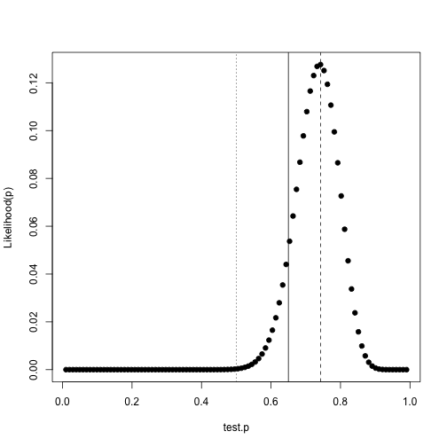
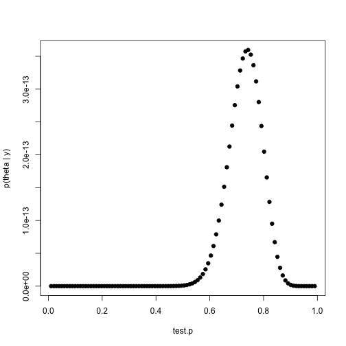
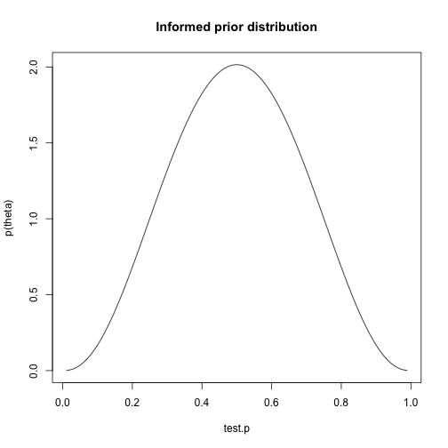
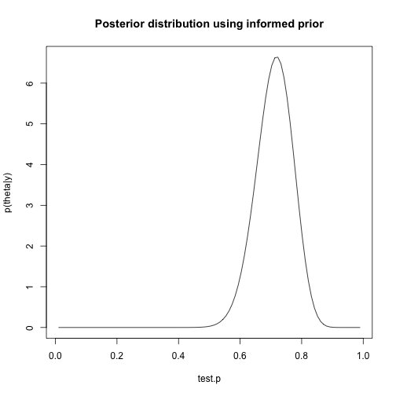
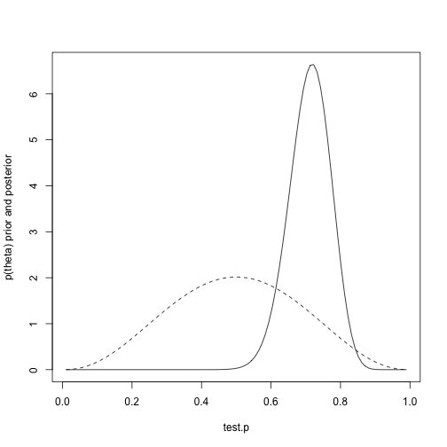

Bayesian Analysis
========================================================

From http://www.r-bloggers.com/24-days-of-r-day-1/?utm_source=feedburner&utm_medium=email&utm_campaign=Feed%3A+RBloggers+%28R+bloggers%29

Perform a random set of 50 coin tosses with a biased coin

```r
set.seed(1234)
tosses <- 50
p <- 0.65
heads <- sum(rbinom(tosses, 1, p))
p.hat <- heads/tosses
p.hat
```

```
## [1] 0.74
```


Assume a uniform prior (no prior view as to fairness of the coin).  
Brute force way to gauge where the prior stands relative to the data. Calculate the probability of generating that many heads using a coin with any probability from 0 to 1.

```r
test.p <- seq(0, 1, length.out = 102)
test.p <- test.p[-c(1, 102)]
like <- dbinom(heads, tosses, test.p)
best.p <- test.p[which(like == max(like))]
plot(test.p, like, ylab = "Likelihood(p)", pch = 19)
abline(v = 0.5, lty = "dotted")
abline(v = p, lty = "solid")
abline(v = best.p, lty = "dashed")
```

 


Find posterior probability algorithmically (from Gelman, et al, p. 30, http://andrewgelman.com/2013/06/26/dont-buy-bayesian-data-analysis/)

```r
posterior.p = test.p^heads * (1 - test.p)^(tosses - heads)
plot(test.p, posterior.p, pch = 19, ylab = "p(theta | y)")
```

 


As expected, identical results  
Assume that the coin was fair, but allow for some variability. Use Jim Albert's beta.select() function to capture parameters of a beta distribution where one believes that p is centered around 0.5

```r
library(LearnBayes)
quantile1 <- list(p = 0.4, x = 0.45)
quantile2 <- list(p = 0.6, x = 0.55)
params <- beta.select(quantile1, quantile2)
alpha <- params[1]
beta <- params[2]

informed.prior <- dbeta(test.p, alpha, beta)
plot(test.p, informed.prior, type = "l", ylab = "p(theta)", main = "Informed prior distribution")
```

 


```r
informed.posterior = dbeta(test.p, alpha + heads, beta + tosses - heads)
plot(test.p, informed.posterior, type = "l", ylab = "p(theta|y)", main = "Posterior distribution using informed prior")
```

 


Show informed prior and posterior density on the same plot

```r
plot(test.p, informed.posterior, type = "l", ylab = "p(theta) prior and posterior")
lines(test.p, informed.prior, lty = "dashed")
```

 


