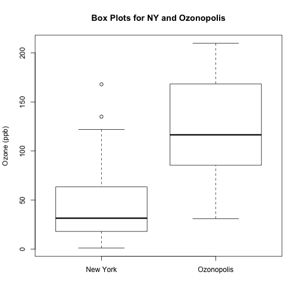
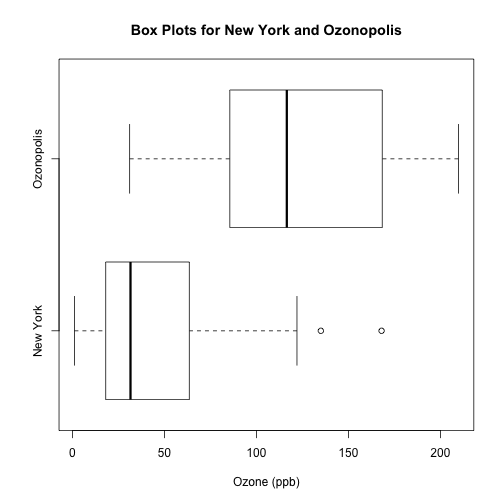
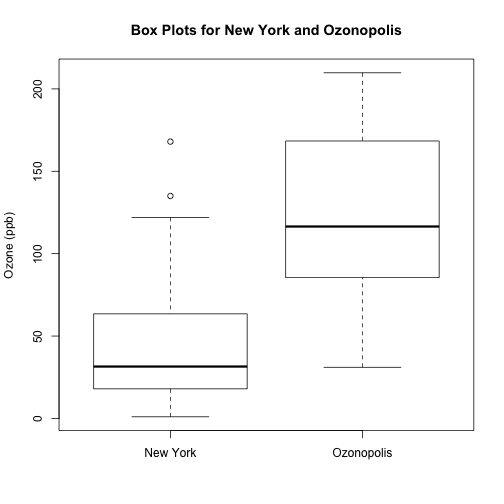
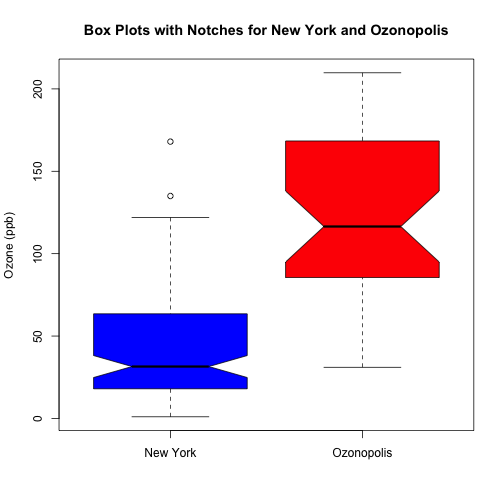

Variations of Box Plots in R for Ozone Concentrations in New York City and Ozonopolis
========================================================

http://chemicalstatistician.wordpress.com/2013/05/26/exploratory-data-analysis-variations-of-box-plots-in-r-for-ozone-concentrations-in-new-york-city-and-ozonopolis/

* Chambers, J. M., Cleveland, W. S., Kleiner, B. and Tukey, P. A. (1983) Graphical Methods for Data Analysis. Wadsworth & Brooks/Cole.
* Kabacoff, Robert. R in Action. Manning Publications Co., 2011.


```r
ozone <- airquality$Ozone
boxplot(ozone, ylab = "Ozone (ppb)", main = "Box Plot of Ozone in New York")
```

 


Interpret box plot
* top and bottom of box are 3rd and 1st quartiles
* line in rectangle is median
* top whisker is max value or 3rd quartile + 1.5 * IQR (IQR = Q3 - Q1) (whichever is smaller)
* bottom whisker is minimum value or 1st quartile - 1.5 * IQR (whichever is larger)

Summary

```r
summary(ozone)
```

```
##    Min. 1st Qu.  Median    Mean 3rd Qu.    Max.    NA's 
##     1.0    18.0    31.5    42.1    63.2   168.0      37
```

```r
fivenum(ozone)
```

```
## [1]   1.0  18.0  31.5  63.5 168.0
```


## simulate ozone pollution data for ozonopolis
Create a 2nd set with rgamma()

```r
set.seed(1)
mean.ozone <- mean(ozone, na.rm = TRUE)
var.ozone <- var(ozone, na.rm = TRUE)
n <- sum(is.na(ozone))
ozone2 <- rgamma(n, shape = mean.ozone^2/var.ozone + 3, scale = var.ozone/mean.ozone + 
    3)
```


plot both box plots

```r
boxplot(ozone, ozone2, ylab = "Ozone (ppb)", names = c("New York", "Ozonopolis"), 
    main = "Box Plots for NY and Ozonopolis")
```

 

```r

# Horizontal
boxplot(ozone, ozone2, xlab = "Ozone (ppb)", names = c("New York", "Ozonopolis"), 
    main = "Box Plots for New York and Ozonopolis", horizontal = T)
```

 


### Using axis() to specify the axes

```r
boxplot(ozone, ozone2, ylab = "Ozone (ppb)", xaxt = "n", main = "Box Plots for New York and Ozonopolis")
axis(1, at = c(1, 2), labels = c("New York", "Ozonopolis"))
```

 

* xaxt='n' suppresses default x-axis labels
* 1st argument of axis()
  * 1 = bottom
  * 2 = left
  * 3 = top
  * 4 = right


### Add notches
If notches don't overlap, the 2 medians are significantly different with 95% confidence

```r
boxplot(ozone, ozone2, notch = T, ylab = "Ozone (ppb)", names = c("New York", 
    "Ozonopolis"), main = "Box Plots with Notches for New York and Ozonopolis", 
    col = c("blue", "red"))
```

 


