From Cookbook for R - Colors(ggplot2)
=============

## Install libraries

```r
library(ggplot2)
library(RColorBrewer)
```


## Sample data

```r
df <- read.table(header = T, text = "\ncond yval\nA 2\nB 2.5\nC 1.6\n")

# Three variables
df2 <- read.table(header = T, text = "\n cond1 cond2 yval\n    A      I 2\n    A      J 2.5\n    A      K 1.6\n    B      I 2.2\n    B      J 2.4\n    B      K 1.2\n    C      I 1.7\n    C      J 2.3\n    C      K 1.9\n")
```


## Simple color assignment

```r
# default
ggplot(df, aes(x=cond, y=yval)) + geom_bar()
```

```
## Mapping a variable to y and also using stat="bin".  With stat="bin", it
## will attempt to set the y value to the count of cases in each group.  This
## can result in unexpected behavior and will not be allowed in a future
## version of ggplot2.  If you want y to represent counts of cases, use
## stat="bin" and don't map a variable to y.  If you want y to represent
## values in the data, use stat="identity".  See ?geom_bar for examples.
## (Deprecated; last used in version 0.9.2)
```

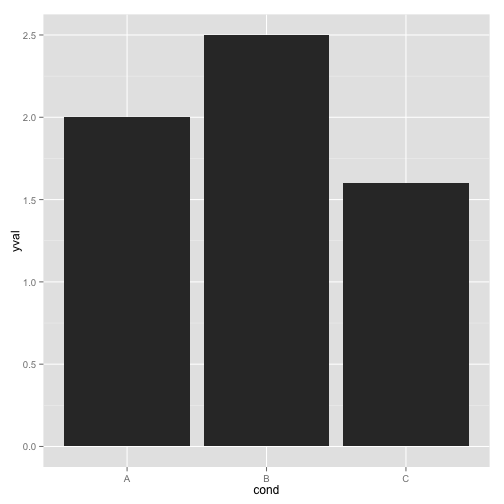 

```r
# bars with red outlines
ggplot(df, aes(x=cond, y=yval)) + geom_bar(colour='#FF9999')
```

```
## Mapping a variable to y and also using stat="bin".  With stat="bin", it
## will attempt to set the y value to the count of cases in each group.  This
## can result in unexpected behavior and will not be allowed in a future
## version of ggplot2.  If you want y to represent counts of cases, use
## stat="bin" and don't map a variable to y.  If you want y to represent
## values in the data, use stat="identity".  See ?geom_bar for examples.
## (Deprecated; last used in version 0.9.2)
```

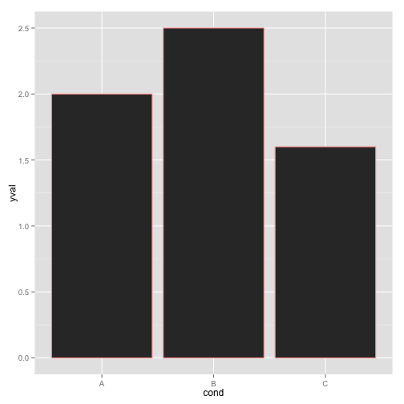 

```r
ggplot(df, aes(x=cond, y=yval)) + geom_bar(stat='identity', fill=rgb(1, 0, 0, .2))
```

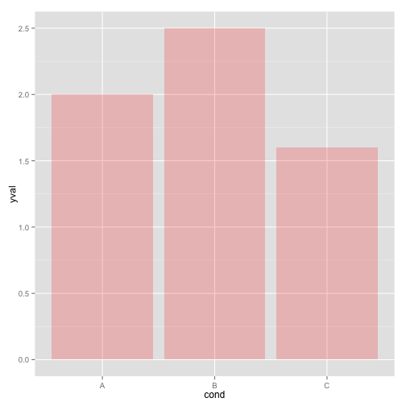 

```r
# red fill, black outlines
ggplot(df, aes(x=cond, y=yval)) + geom_bar(fill='#FF9999', colour='black')
```

```
## Mapping a variable to y and also using stat="bin".  With stat="bin", it
## will attempt to set the y value to the count of cases in each group.  This
## can result in unexpected behavior and will not be allowed in a future
## version of ggplot2.  If you want y to represent counts of cases, use
## stat="bin" and don't map a variable to y.  If you want y to represent
## values in the data, use stat="identity".  See ?geom_bar for examples.
## (Deprecated; last used in version 0.9.2)
```

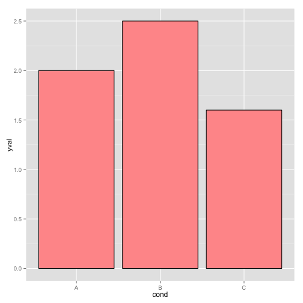 

```r

# Standard black lines and points
ggplot(df, aes(x=cond, y=yval)) + 
  geom_line(aes(group=1)) + # group points otherwise no line will show
  geom_point(size=3)
```

 

```r

# Dark blue lines, red dots
ggplot(df, aes(x=cond, y=yval)) + 
  geom_line(aes(group=1), colour='#000099') +
  geom_point(size=3, colour='#cc0000')
```

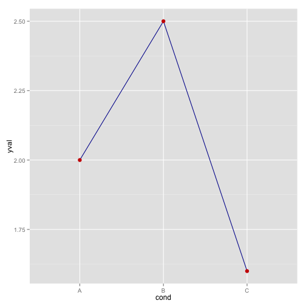 


## Map variable values to colors

```r
# bars: x and fill both depend on cond2
ggplot(df, aes(x = cond, y = yval, fill = cond)) + geom_bar(stat = "identity")
```

 

```r

# bars with other dataset, fill depends on cond2
ggplot(df2, aes(x = cond1, y = yval)) + geom_bar(aes(fill = cond2), colour = "black", 
    position = position_dodge())
```

```
## Mapping a variable to y and also using stat="bin".  With stat="bin", it
## will attempt to set the y value to the count of cases in each group.  This
## can result in unexpected behavior and will not be allowed in a future
## version of ggplot2.  If you want y to represent counts of cases, use
## stat="bin" and don't map a variable to y.  If you want y to represent
## values in the data, use stat="identity".  See ?geom_bar for examples.
## (Deprecated; last used in version 0.9.2)
```

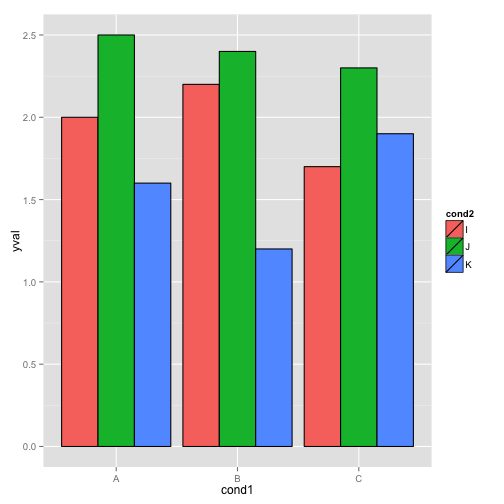 

```r

ggplot(df2, aes(x = cond1, y = yval, colour = cond2)) + geom_line(aes(group = cond2)) + 
    geom_point(size = 3)
```

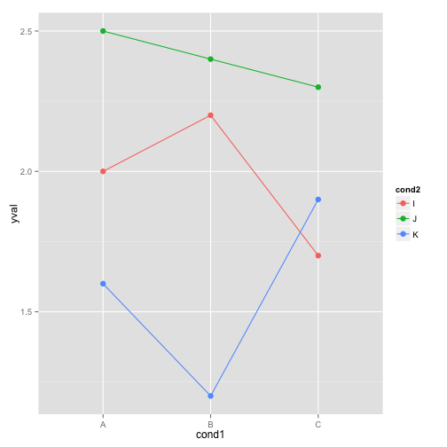 


## Colorblind-friendly palette
Define your own palette for later use

```r
# Can store palette to a variable then use it later - HOW?  The palette with
# grey:
cbPalette <- c("#999999", "#E69F00", "#56B4E9", "#009E73", "#F0E442", "#0072B2", 
    "#D55E00", "#CC79A7")

# The palette with black:
cbbPalette <- c("#000000", "#E69F00", "#56B4E9", "#009E73", "#F0E442", "#0072B2", 
    "#D55E00", "#CC79A7")

# To use for fills, add
scale_fill_manual(values = cbPalette)
```

```
## discrete_scale(aesthetics = aesthetic, scale_name = "manual", 
##     palette = pal)
```

```r

# To use for line and point colors, add
scale_colour_manual(values = cbPalette)
```

```
## discrete_scale(aesthetics = aesthetic, scale_name = "manual", 
##     palette = pal)
```


## Color selection

```r
# equivalent - by default, scale_fill_hue() is used
ggplot(df, aes(x = cond, y = yval, fill = cond)) + geom_bar(stat = "identity")
```

 

```r
ggplot(df, aes(x = cond, y = yval, fill = cond)) + geom_bar(stat = "identity") + 
    scale_fill_hue()
```

 

```r

ggplot(df, aes(x = cond, y = yval, colour = cond)) + geom_point(size = 8)
```

 

```r
ggplot(df, aes(x = cond, y = yval, colour = cond)) + geom_point(size = 8) + 
    scale_colour_hue()
```

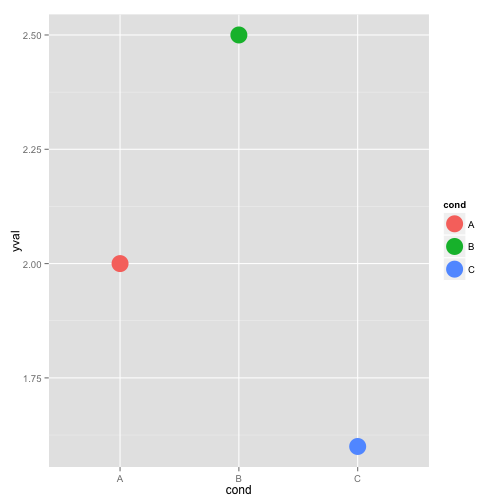 


## Change luminance and saturation (chromacity)

```r
# Change luminance to 40 (instead of default 65)
ggplot(df, aes(x = cond, y = yval, fill = cond)) + geom_bar(stat = "identity") + 
    scale_fill_hue()
```

 

```r
ggplot(df, aes(x = cond, y = yval, fill = cond)) + geom_bar(stat = "identity") + 
    scale_fill_hue(l = 40)
```

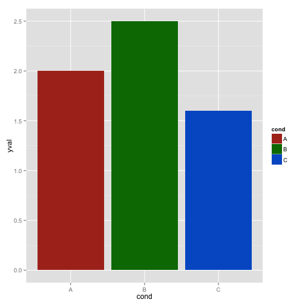 

```r
# Change luminance to 40, and reduce saturation (chromacity) from 100 to 50
ggplot(df, aes(x = cond, y = yval, fill = cond)) + geom_bar(stat = "identity") + 
    scale_fill_hue()
```

 

```r
ggplot(df, aes(x = cond, y = yval, fill = cond)) + geom_bar(stat = "identity") + 
    scale_fill_hue(c = 45)
```

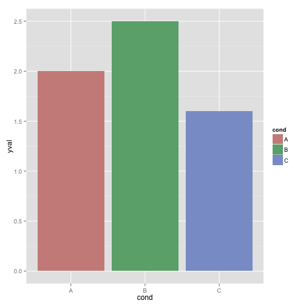 

```r
ggplot(df, aes(x = cond, y = yval, fill = cond)) + geom_bar(stat = "identity") + 
    scale_fill_hue(l = 80, c = 45)
```

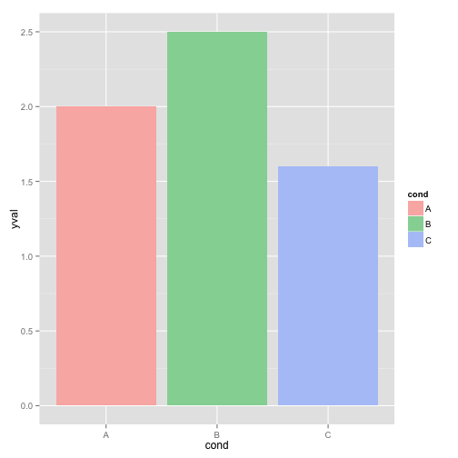 


## Using RColorBrewer

```r
ggplot(df, aes(x = cond, y = yval, fill = cond)) + geom_bar(stat = "identity") + 
    scale_fill_brewer()
```

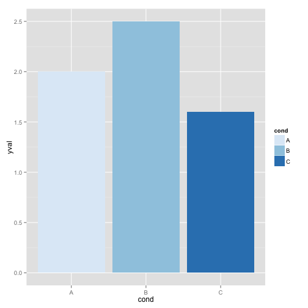 

```r
ggplot(df, aes(x = cond, y = yval, fill = cond)) + geom_bar(stat = "identity") + 
    scale_fill_brewer(palette = "Set1")
```

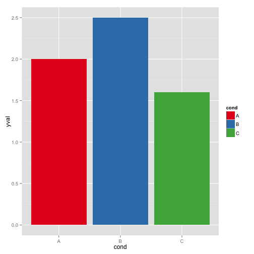 

```r
ggplot(df, aes(x = cond, y = yval, fill = cond)) + geom_bar(stat = "identity") + 
    scale_fill_brewer(palette = "Spectral")
```

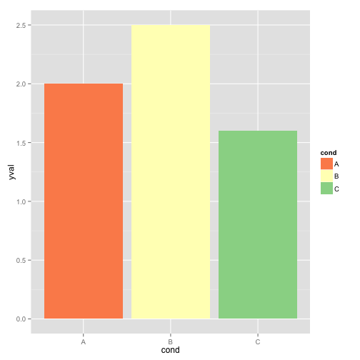 

```r
# Note: use scale_colour_brewer() for lines and points
```


## Manually define Palette
Define your own set of colors with scale_fill_manual()

```r
ggplot(df, aes(x = cond, y = yval, fill = cond)) + geom_bar(stat = "identity") + 
    scale_fill_manual(values = c("red", "blue", "green"))
```

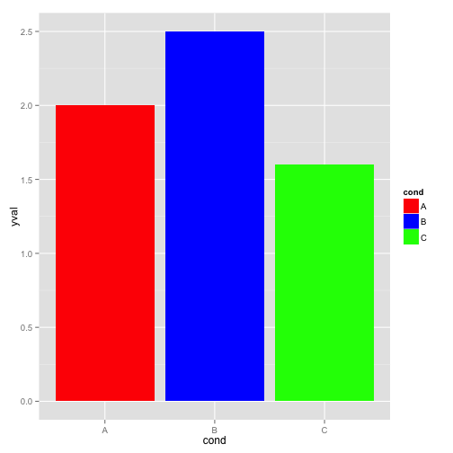 

```r
ggplot(df, aes(x = cond, y = yval, fill = cond)) + geom_bar(stat = "identity") + 
    scale_fill_manual(values = c("#cc6666", "#9999cc", "#66cc99"))
```

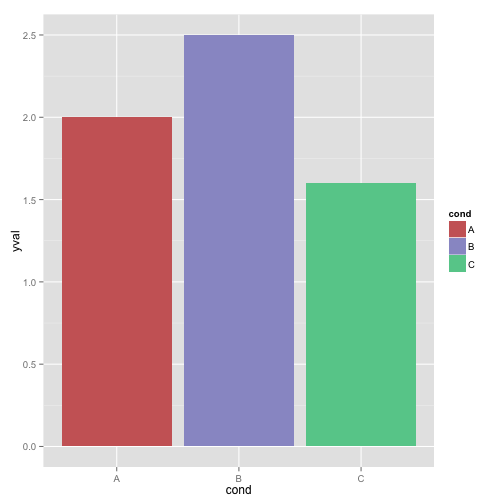 

```r
# Note: use scale_colour_manual() for lines and points
```


## Continuous colors

```r
set.seed(133)
df2 <- data.frame(xval = rnorm(50), yval = rnorm(50))

# make color depend on yval
ggplot(df2, aes(x = xval, y = yval, colour = yval)) + geom_point()
```

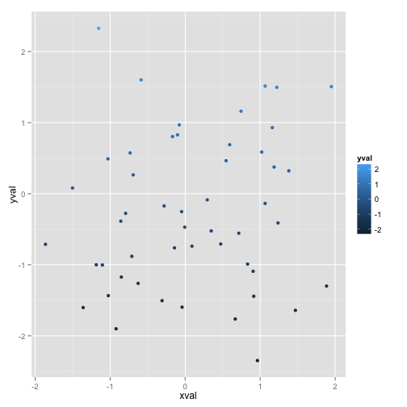 

```r

# use a different gradient
ggplot(df2, aes(x = xval, y = yval, colour = yval)) + geom_point() + scale_colour_gradientn(colours = rainbow(2))
```

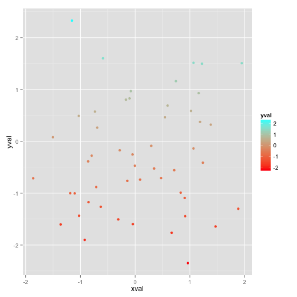 

```r
ggplot(df2, aes(x = xval, y = yval, colour = yval)) + geom_point() + scale_colour_gradientn(colours = rainbow(4))
```

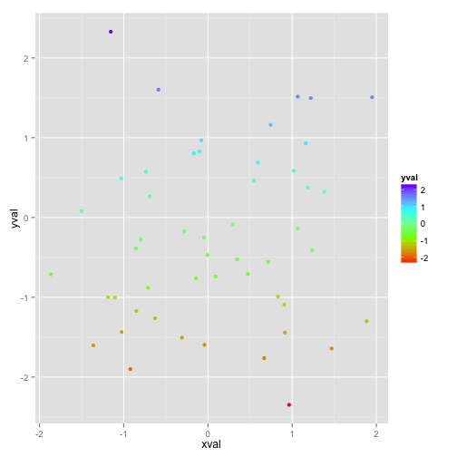 

```r
ggplot(df2, aes(x = xval, y = yval, colour = yval)) + geom_point() + scale_colour_gradientn(colours = rainbow(10))
```

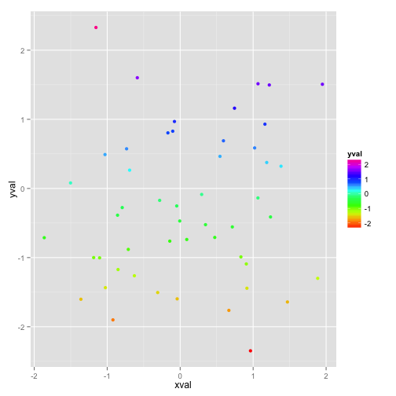 


Qualitative Brewer Packages good for qualitative data

Accent 8

Dark2 8

Paired 12

Pastel1 9

Pastel2 8

Set1 9

Set2 8

Set3 12

# Create a palette and display it

```r
pal <- brewer.pal(3, "Greens")
image(1:7, 1, as.matrix(1:7), col = pal, xlab = "Greens (sequential)", ylab = "", 
    xaxt = "n", yaxt = "n", bty = "n")
```

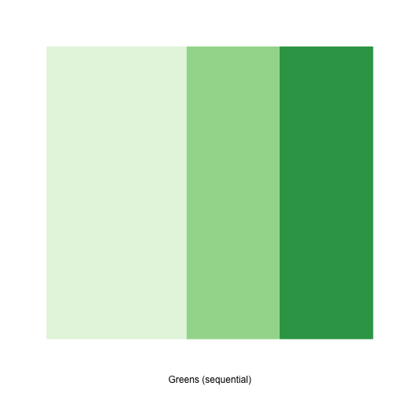 

```r

# display a divergent palette
display.brewer.pal(7, "BrBG")
```

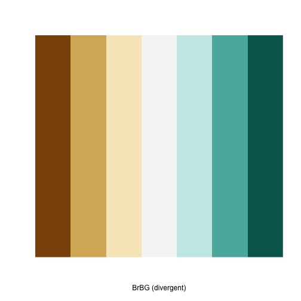 

```r

# display a qualitative palette
display.brewer.pal(7, "Accent")
```

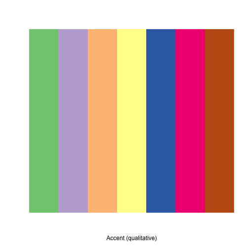 

```r

# Display n palettes simultaneously
display.brewer.all(n = 10, exact.n = FALSE)
```

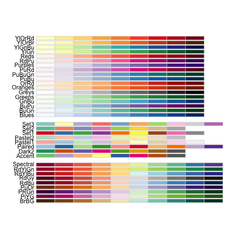 

```r
display.brewer.all(n = 10)
```

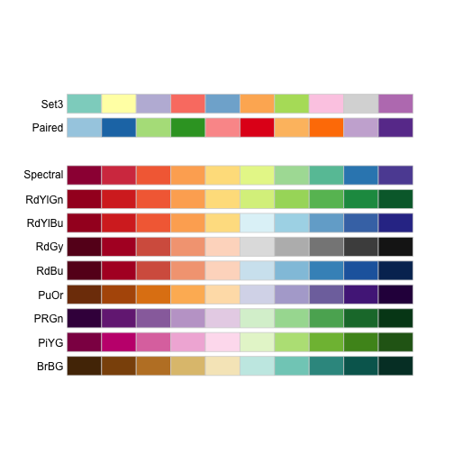 

```r
display.brewer.all()
```

 

```r
display.brewer.all(type = "div")
```

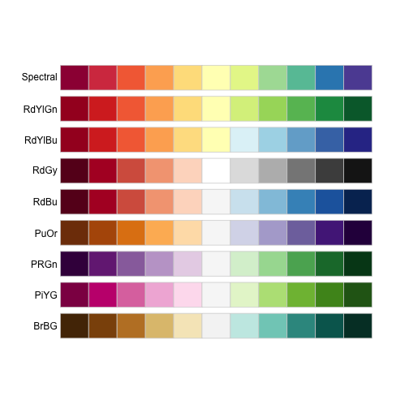 

```r
display.brewer.all(type = "seq")
```

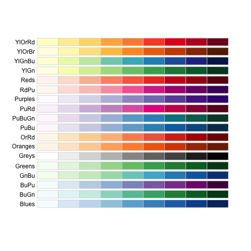 

```r
display.brewer.all(type = "qual")
```

 

```r
display.brewer.all(n = 5, type = "div", exact.n = TRUE)
```

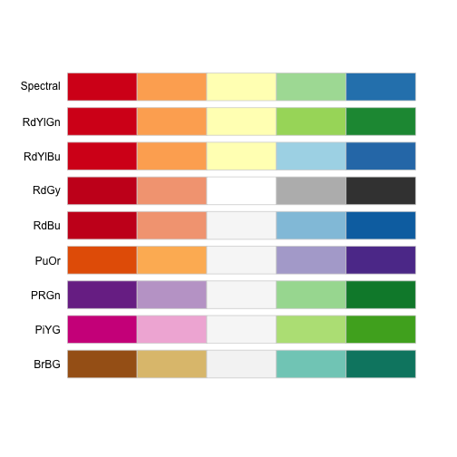 

```r
brewer.pal.info
```

```
##          maxcolors category
## BrBG            11      div
## PiYG            11      div
## PRGn            11      div
## PuOr            11      div
## RdBu            11      div
## RdGy            11      div
## RdYlBu          11      div
## RdYlGn          11      div
## Spectral        11      div
## Accent           8     qual
## Dark2            8     qual
## Paired          12     qual
## Pastel1          9     qual
## Pastel2          8     qual
## Set1             9     qual
## Set2             8     qual
## Set3            12     qual
## Blues            9      seq
## BuGn             9      seq
## BuPu             9      seq
## GnBu             9      seq
## Greens           9      seq
## Greys            9      seq
## Oranges          9      seq
## OrRd             9      seq
## PuBu             9      seq
## PuBuGn           9      seq
## PuRd             9      seq
## Purples          9      seq
## RdPu             9      seq
## Reds             9      seq
## YlGn             9      seq
## YlGnBu           9      seq
## YlOrBr           9      seq
## YlOrRd           9      seq
```

```r

brewer.pal.info["Blues", ]
```

```
##       maxcolors category
## Blues         9      seq
```

```r
brewer.pal.info["Blues", ]$maxcolors
```

```
## [1] 9
```


## Create a combined palette?

```r
pal <- c(brewer.pal(n = 12, name = "Paired"), brewer.pal(n = 9, name = "Pastel1"), 
    brewer.pal(n = 9, name = "Set1"))
pal <- unique(pal)
pal
```

```
##  [1] "#A6CEE3" "#1F78B4" "#B2DF8A" "#33A02C" "#FB9A99" "#E31A1C" "#FDBF6F"
##  [8] "#FF7F00" "#CAB2D6" "#6A3D9A" "#FFFF99" "#B15928" "#FBB4AE" "#B3CDE3"
## [15] "#CCEBC5" "#DECBE4" "#FED9A6" "#FFFFCC" "#E5D8BD" "#FDDAEC" "#F2F2F2"
## [22] "#E41A1C" "#377EB8" "#4DAF4A" "#984EA3" "#FFFF33" "#A65628" "#F781BF"
## [29] "#999999"
```


