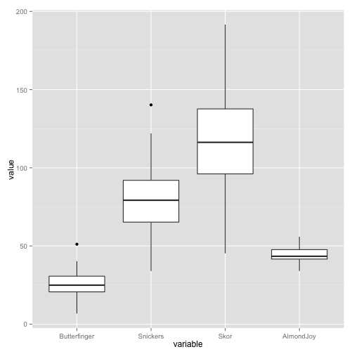

Draw a boxplot

========================================================


```r
require(reshape2)
```

```
## Loading required package: reshape2
```

```r
require(ggplot2)

df <- data.frame(Butterfinger = rnorm(50, 25, 10), Snickers = rnorm(50, 75, 
    20), Skor = rnorm(50, 115, 35), AlmondJoy = rnorm(50, 45, 5))
head(df)
```

```
##   Butterfinger Snickers   Skor AlmondJoy
## 1        13.90    71.99 126.29     39.23
## 2        25.89    78.54 125.57     48.78
## 3        26.29    55.22 191.61     47.36
## 4        34.08    87.56  96.62     49.87
## 5        22.53    81.13 111.82     43.15
## 6        19.64    75.92 174.49     46.14
```

```r

df.melt <- melt(df)
```

```
## Using as id variables
```

```r
head(df.melt)
```

```
##       variable value
## 1 Butterfinger 13.90
## 2 Butterfinger 25.89
## 3 Butterfinger 26.29
## 4 Butterfinger 34.08
## 5 Butterfinger 22.53
## 6 Butterfinger 19.64
```

```r

ggplot(df.melt, aes(x = variable, y = value)) + geom_boxplot()
```

 

