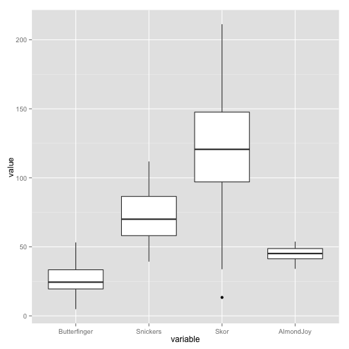
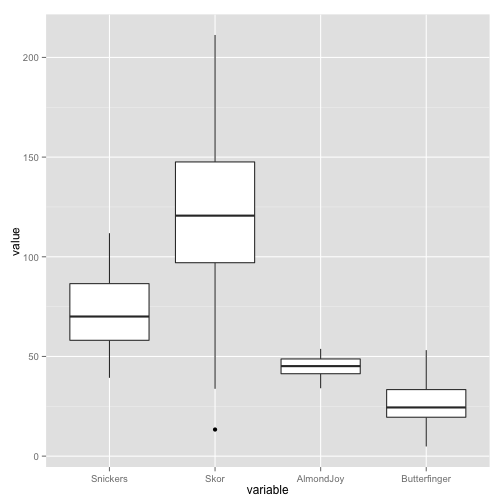
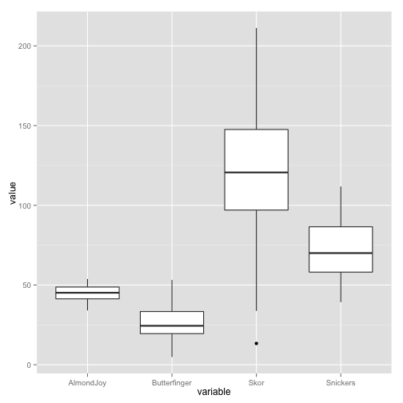

Draw a boxplot

========================================================


```r
require(reshape2)
```

```
## Loading required package: reshape2
```

```r
require(ggplot2)

df <- data.frame(Butterfinger = rnorm(50, 25, 10), Snickers = rnorm(50, 75, 
    20), Skor = rnorm(50, 115, 35), AlmondJoy = rnorm(50, 45, 5))
head(df)
```

```
##   Butterfinger Snickers   Skor AlmondJoy
## 1        20.01    92.92 211.26     47.57
## 2        20.95    78.56 136.01     45.09
## 3         7.72    52.86  80.21     47.43
## 4        30.46    58.31 175.03     47.27
## 5        37.40    70.88 122.27     47.39
## 6        30.46    58.92  81.33     38.58
```

```r

df.melt <- melt(df)
```

```
## Using as id variables
```

```r
ggplot(df.melt, aes(x = variable, y = value)) + geom_boxplot()
```

 

```r

# order once
df.melt$variable <- factor(df.melt$variable, levels = c("Snickers", "Skor", 
    "AlmondJoy", "Butterfinger"))
ggplot(df.melt, aes(x = variable, y = value)) + geom_boxplot()
```

 

```r

# order alphabetically
df.melt$variable <- factor(df.melt$variable, levels = sort(levels(df.melt$variable)))

head(df.melt)
```

```
##       variable value
## 1 Butterfinger 20.01
## 2 Butterfinger 20.95
## 3 Butterfinger  7.72
## 4 Butterfinger 30.46
## 5 Butterfinger 37.40
## 6 Butterfinger 30.46
```

```r

ggplot(df.melt, aes(x = variable, y = value)) + geom_boxplot()
```

 

