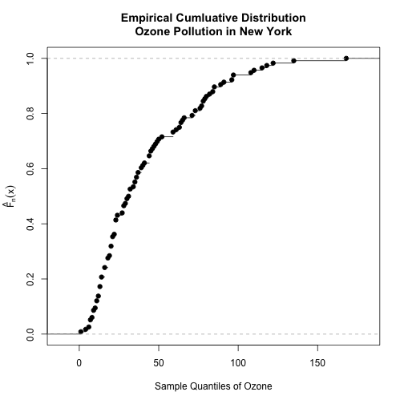
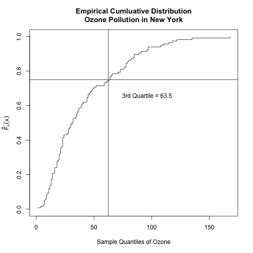

2 ways of plotting empirical cdf distibution functions
========================================================

http://chemicalstatistician.wordpress.com/2013/06/25/exploratory-data-analysis-2-ways-of-plotting-empirical-cumulative-distribution-functions-in-r/

Use the ozone data set

## get data and calculate key summary statistics

How many non-missing rows are there?

```r
# extract 'Ozone' data vector for New York
ozone <- airquality$Ozone
# how many non-missing values?
n <- sum(!is.na(ozone))
```


Use ecdf() to obtain empirical cdf values

```r
ozone.ecdf <- ecdf(ozone)
ozone.ecdf
```

```
## Empirical CDF 
## Call: ecdf(ozone)
##  x[1:67] =   1,   4,   6,  ..., 1.4e+02, 1.7e+02
```


Use plot() to plot ecdf

```r
plot(ozone.ecdf, xlab = "Sample Quantiles of Ozone", ylab = "", main = "Empirical Cumluative Distribution\nOzone Pollution in New York")
mtext(text = expression(hat(F)[n](x)), side = 2, line = 2.5)
```

 

```r
# plot.ecdf(ozone)
```


## Method 2

* calculate cumulative probabilities
* order the data
* plort the cumulative probabilities against the ordered data

```r
summary(fivenum(ozone))
```

```
##    Min. 1st Qu.  Median    Mean 3rd Qu.    Max. 
##     1.0    18.0    31.5    56.4    63.5   168.0
```

```r
fivenum(ozone)
```

```
## [1]   1.0  18.0  31.5  63.5 168.0
```

```r

# ordering the ozone data
ozone.ordered <- sort(ozone)
```


```r
# plot the possible values of probability (0 to 1) against the ordered ozone
# data (sample quantiles of ozone) notice the option type = 's' for plotting
# the step functions
plot(ozone.ordered, (1:n)/n, type = "s", ylim = c(0, 1), xlab = "Sample Quantiles of Ozone", 
    ylab = "", main = "Empirical Cumluative Distribution\nOzone Pollution in New York")

# x values = ozone.ordered y values = (1:n)/n

# mark the 3rd quartile
abline(v = 62.5, h = 0.75)

# add a legend
legend(65, 0.7, "3rd Quartile = 63.5", box.lwd = 0)

# add the label on the y-axis
mtext(text = expression(hat(F)[n](x)), side = 2, line = 2.5)
```

 

