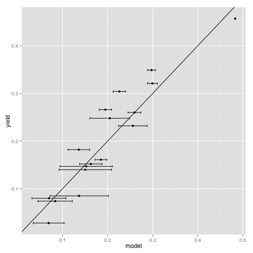

Generaized Linear Models for Predicting Rates
========================================================

1/1/14
http://www.r-bloggers.com/generalized-linear-models-for-predicting-rates/?utm_source=feedburner&utm_medium=email&utm_campaign=Feed%3A+RBloggers+%28R+bloggers%29

For non-frequency (and non-categorical) rate problems (such as forecasting yield or purity) we suggest beta regression.

* What's beta regression?

In this note we will work a toy problem and suggest some relevant R analysis libraries.There are three primary settings for rate estimation problems:

1. Each data row represents a single observation and y is a 0/1 variable, categorical or logical. In this case we come to rates by asking for a probability forecast of how likely a given row has y=1.
2. Each data row represents many observations and y is a frequency between 0 and 1. In this case we need an additional weight to represent how many observations each row represents (so we can pass this detail on to various fitters). This representation is just a different encoding of the first setting.
3. Each data row represents a single observation and y is an observed quantity between 0 and 1. We think of y in this case as being a non-frequency rate (since each row represents a single event) and examples include y’s that measure purity, fullness, or yield.

To get away from online advertising for a moment consider the following (artificial) problem: predicting y as a function of x1 and x2 for the following data.


```r
d <- data.frame(y = c(1, 1, 1, 0, 0, 0), x1 = c(-1e+06, 20000, -1, 2, 10000, 
    10000), x2 = c(1e+06, 30000, 0, 1, 1000, 1000))
```


This problem is just an encoding of the law x1 < x2, but because the relative magnitudes of x1 and x2 are varying so much a linear regression can not pick up the relation:


```r
mod <- lm(y ~ x1 + x2, data = d)
mod
```

```
## 
## Call:
## lm(formula = y ~ x1 + x2, data = d)
## 
## Coefficients:
## (Intercept)           x1           x2  
##    2.22e-01     1.20e-05     1.28e-05
```

```r
predict(mod)
```

```
##      1      2      3      4      5      6 
## 1.0040 0.8441 0.2217 0.2217 0.3542 0.3542
```


Notice how the predictions don’t have a cut-point separating “y” (items 1,2,3) from “n” (items 4,5,6). This is despite the fact that the linear form x2-x1 is a perfect decision surface. The issue is linear regression is looking for a scoring function (not a decision surface) and is punished if it predicts out of the (0,1) range. If the answer is “1″ and the linear model predicts “5″ this counts as a lot of error. So a lot of the power of the linear model is wasted trying to push values back into the range 0 to 1.


```r
lr <- glm(y ~ x1 + x2, data = d, family = binomial(link = "logit"))
```

```
## Warning: glm.fit: algorithm did not converge
```

```
## Warning: glm.fit: fitted probabilities numerically 0 or 1 occurred
```

```r
predict(lr, type = "response")
```

```
##         1         2         3         4         5         6 
## 1.000e+00 1.000e+00 9.999e-01 1.301e-04 2.220e-16 2.220e-16
```


Logistic regression = glm with logistic link

__Logistic regression should always be considered when trying to estimate probabilities of frequencies.__

It is an efficient method that tends to work well and has useful probabilistic derivations and interpretations. For estimating rates that don’t arise from category probabilities or frequencies you can still try logistic regression (and many other common generalized linear models), but we suggest also trying a method called beta regression. Beta regression allows the user to specify:

1. One formula and link for the rate or mean estimate.
2. One formula and link for a per-example error model.


```r
install.packages("betareg")
```

```
## Error: trying to use CRAN without setting a mirror
```

```r
library(betareg)
```

```
## Loading required package: Formula
```

```r

data("GasolineYield", package = "betareg")
set.seed(52352)
dim(GasolineYield)
```

```
## [1] 32  6
```

```r
head(GasolineYield)
```

```
##   yield gravity pressure temp10 temp batch
## 1 0.122    50.8      8.6    190  205     1
## 2 0.223    50.8      8.6    190  275     1
## 3 0.347    50.8      8.6    190  345     1
## 4 0.457    50.8      8.6    190  407     1
## 5 0.080    40.8      3.5    210  218     2
## 6 0.131    40.8      3.5    210  273     2
```

```r
GasolineYield$rgroup <- sample(1:100, size = dim(GasolineYield)[[1]], replace = TRUE)
GTrain <- subset(GasolineYield, GasolineYield$rgroup <= 50)
GTest <- subset(GasolineYield, GasolineYield$rgroup > 50)

gy <- betareg(yield ~ gravity + pressure + temp | gravity + pressure + temp, 
    data = GTrain)

print(summary(gy))
```

```
## 
## Call:
## betareg(formula = yield ~ gravity + pressure + temp | gravity + 
##     pressure + temp, data = GTrain)
## 
## Standardized weighted residuals 2:
##    Min     1Q Median     3Q    Max 
## -1.565 -1.187 -0.244  0.715  1.880 
## 
## Coefficients (mean model with logit link):
##              Estimate Std. Error z value Pr(>|z|)    
## (Intercept) -6.044463   0.205371  -29.43  < 2e-16 ***
## gravity      0.027248   0.004507    6.05  1.5e-09 ***
## pressure     0.104329   0.009880   10.56  < 2e-16 ***
## temp         0.009079   0.000233   38.91  < 2e-16 ***
## 
## Phi coefficients (precision model with log link):
##              Estimate Std. Error z value Pr(>|z|)    
## (Intercept) -15.86267    3.71246   -4.27  1.9e-05 ***
## gravity       0.34323    0.07592    4.52  6.1e-06 ***
## pressure      0.21611    0.17088    1.26   0.2060    
## temp          0.02249    0.00578    3.89   0.0001 ***
## ---
## Signif. codes:  0 '***' 0.001 '**' 0.01 '*' 0.05 '.' 0.1 ' ' 1 
## 
## Type of estimator: ML (maximum likelihood)
## Log-likelihood: 41.4 on 8 Df
## Pseudo R-squared: 0.926
## Number of iterations: 50 (BFGS) + 21 (Fisher scoring)
```

```r

GTest$model <- predict(gy, newdata = GTest)
library(ggplot2)
ggplot(data = GTest, aes(x = model, y = yield)) + geom_point() + geom_abline(slope = 1)
```

 


This is a great fit (pseudo R-squared of 0.93). Though we really didn’t see any improvement over what lm() would have delivered (which itself has an R-squared of 0.97). Also notice we get properly bounded predictions, even without specifying a non-identity link. But we do have access to the argument sensitive error model which lets the following code produce our next figure: predictions with uncertainty ranges.


```r
GTest$modelErr <- sqrt(predict(gy, newdata = GTest, type = "variance"))
ggplot(data = GTest, aes(x = model, y = yield)) + geom_point() + geom_errorbarh(aes(xmin = model - 
    modelErr, xmax = model + modelErr)) + geom_abline(slope = 1)
```

 


This is pretty useful in practice.

So far we have been using beta regression on data where each row is a single measurement carrying a rate (not a frequency or fraction of success, but per-row measurement like how pure a product is). We could also attempt to use beta regression for data where each row is a single example that is a success or failure and we are trying to estimate rates (as we did using glm()). The first issue is to even attempt this we must first make sure our y’s are in the open interval (0,1). One such way to do this is as follows:


```r
d
```

```
##   y     x1    x2
## 1 1 -1e+06 1e+06
## 2 1  2e+04 3e+04
## 3 1 -1e+00 0e+00
## 4 0  2e+00 1e+00
## 5 0  1e+04 1e+03
## 6 0  1e+04 1e+03
```

```r
d$yCollared <- pmin(pmax(1/dim(d)[[1]], d$y), 1 - 1/dim(d)[[1]])
d
```

```
##   y     x1    x2 yCollared
## 1 1 -1e+06 1e+06    0.8333
## 2 1  2e+04 3e+04    0.8333
## 3 1 -1e+00 0e+00    0.8333
## 4 0  2e+00 1e+00    0.1667
## 5 0  1e+04 1e+03    0.1667
## 6 0  1e+04 1e+03    0.1667
```

```r

bm <- betareg(yCollared ~ x1 + x2, data = d, link = "logit")
predict(bm, newdata = d, type = "response")
```

```
##      1      2      3      4      5      6 
## 0.7498 0.6791 0.3402 0.3402 0.4106 0.4106
```


And we seem to get a poor result very similar to linear regression (not separating the training examples, but at least all in the range (0,1)). Frankly the package seems to not be very sensitive to my attempts to set link and/or link.phi for this example. That is a hint we are not using the method as intended. 

__The observation is: you want to try beta regression when you are estimating non-frequency rates and not when estimating probabilities or frequencies.__


