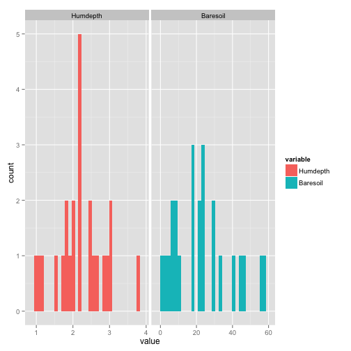

Using gridExtra
========================================================
Source
* http://www.r-bloggers.com/extra-extra-get-your-gridextra/


```r
library(ggplot2)  #for plotting
library(reshape2)  #for data reshaping
library(gridExtra)
```

```
## Loading required package: grid
```

```r

library(vegan)  #for the data
```

```
## Loading required package: permute
```

```
## Loading required package: lattice
```

```
## This is vegan 2.0-9
```

```r
data(varechem)
```

 
First, reshape the data so that Hummus depth and Bare soil are your grouping variables

```r
vMelt <- melt(varechem, measure.vars = c("Humdepth", "Baresoil"))
```

 
Now plot it.  Use fill to color things differently, facet_wrap to split this into two panels,
And don't forget that the x scales are different - otherwise things look odd

```r
qplot(value, data = vMelt, fill = variable) + facet_wrap(facets = ~variable, 
    scale = "free_x")
```

```
## stat_bin: binwidth defaulted to range/30. Use 'binwidth = x' to adjust
## this.
```

```
## stat_bin: binwidth defaulted to range/30. Use 'binwidth = x' to adjust
## this.
```

 


This produces a nice graph. But, man, I had to think about reshaping things, and all of those scales? What if I just wanted to make two historgrams, and slam ‘em together. This is where gridExtra is really nice. Through its function grid.arrange, you can make a multi-paneled graph using ggplot2 plots, lattice plots, and more (although, not regular R plots…I think).

So, let’s see the same example, but with gridExtra.


