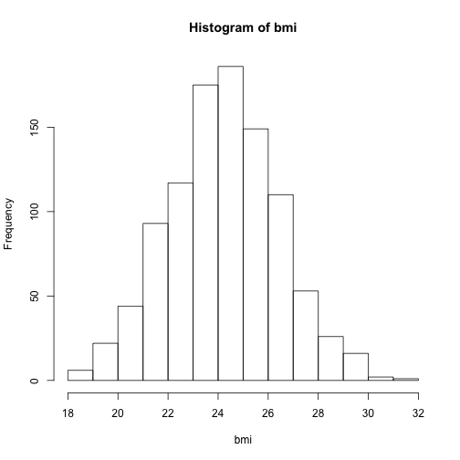
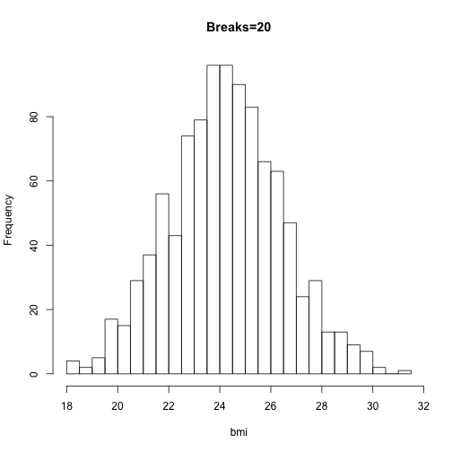
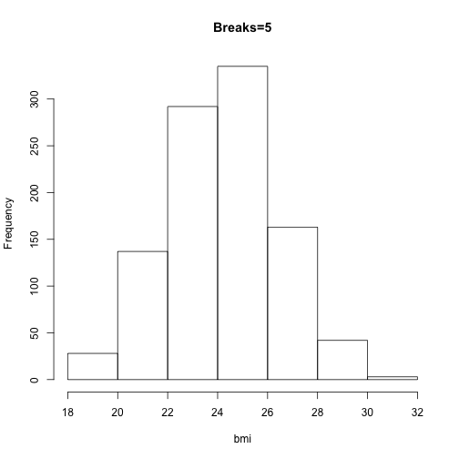
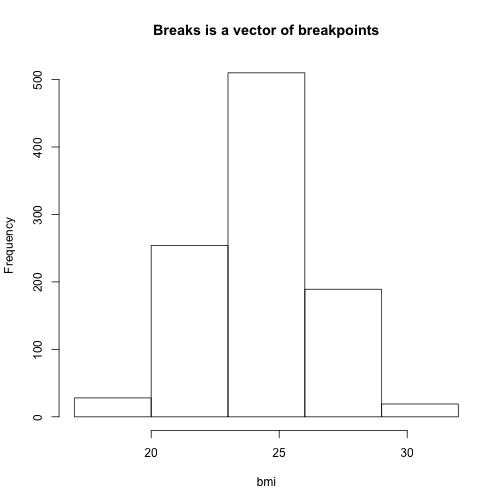
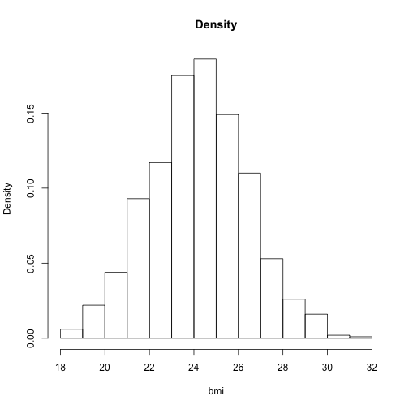
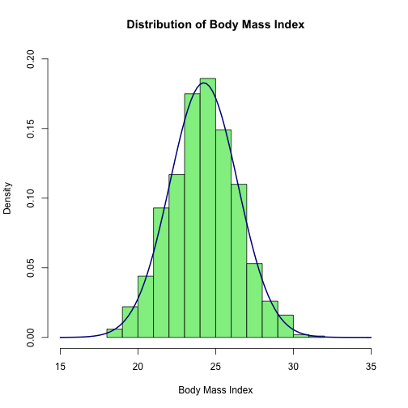

Basics of Histograms
========================================================

from: http://www.r-bloggers.com/basics-of-histograms/

## Create data

```r
set.seed(123)
bmi <- rnorm(n = 1000, m = 24.2, sd = 2.2)
```


## Basic histogram

```r
hist(bmi)
```

 


## What info does hist() give?

```r
histinfo <- hist(bmi)
```

 

```r
histinfo
```

```
## $breaks
##  [1] 18 19 20 21 22 23 24 25 26 27 28 29 30 31 32
## 
## $counts
##  [1]   6  22  44  93 117 175 186 149 110  53  26  16   2   1
## 
## $density
##  [1] 0.006 0.022 0.044 0.093 0.117 0.175 0.186 0.149 0.110 0.053 0.026
## [12] 0.016 0.002 0.001
## 
## $mids
##  [1] 18.5 19.5 20.5 21.5 22.5 23.5 24.5 25.5 26.5 27.5 28.5 29.5 30.5 31.5
## 
## $xname
## [1] "bmi"
## 
## $equidist
## [1] TRUE
## 
## attr(,"class")
## [1] "histogram"
```


## Change number of bins

```r
hist(bmi, breaks = 20, main = "Breaks=20")
```

 

```r
hist(bmi, breaks = 5, main = "Breaks=5")
```

 


## Breakpoints from vector
breaks are *start* and *end* of each bin.

Breaks are right closed (a, b]

Change this with right=FALSE to be [a, b)

```r
hist(bmi, breaks = c(17, 20, 23, 26, 29, 32), main = "Breaks is a vector of breakpoints")
```

 


## Density plot

```r
hist(bmi, freq = FALSE, main = "Density")
```

 


## Look at output
use plot=FALSE to just get output, no plot

```r
hist1 <- hist(bmi, plot = FALSE)
hist1$density
```

```
##  [1] 0.006 0.022 0.044 0.093 0.117 0.175 0.186 0.149 0.110 0.053 0.026
## [12] 0.016 0.002 0.001
```


## density with bins of size != 1

```r
hist2 <- hist(bmi, plot = FALSE, breaks = c(17, 25, 26, 32))
hist3 <- hist(bmi, breaks = c(17, 25, 26, 32))
```

 

```r
sum(hist2$density)
```

```
## [1] 0.264
```

```r
diff(hist2$breaks)
```

```
## [1] 8 1 6
```

```r
sum(diff(hist2$breaks) * hist2$density)
```

```
## [1] 1
```


## Plot aesthetics

```r
hist3 <- hist(bmi, freq = FALSE, xlab = "Body Mass Index", main = "Distribution of Body Mass Index", 
    col = "lightgreen", xlim = c(15, 35), ylim = c(0, 0.2))

# Add a normal distribution curve using curve()
curve(dnorm(x, mean = mean(bmi), sd = sd(bmi)), add = TRUE, col = "darkblue", 
    lwd = 2)
```

 

