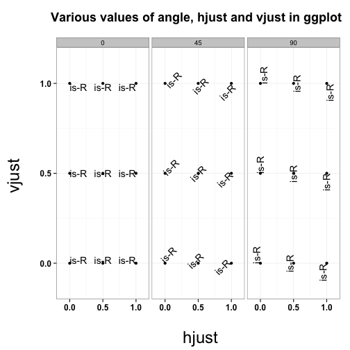
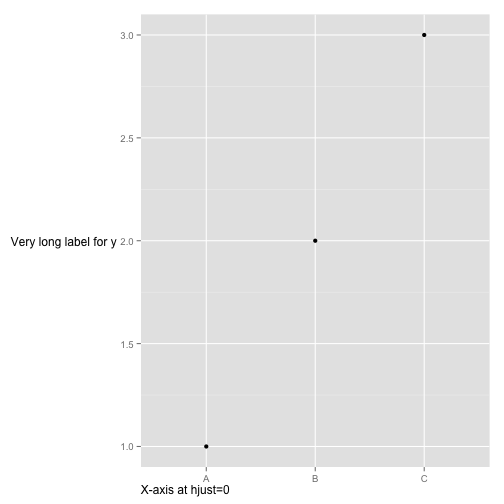
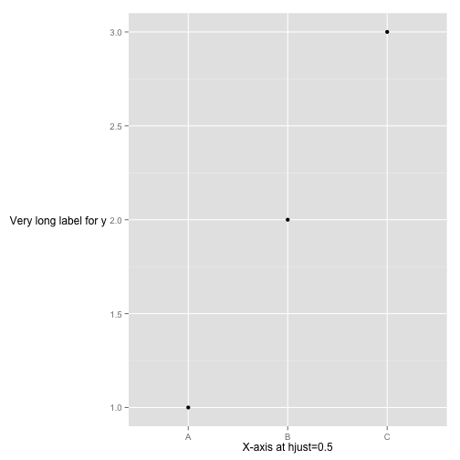
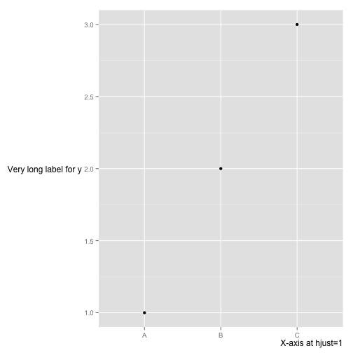
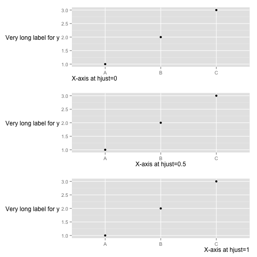
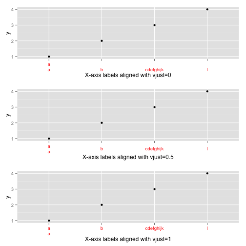

Hjust and vjust
========================================================
Sources:
* https://gist.github.com/cdesante/4070548
* http://stackoverflow.com/questions/7263849/what-do-hjust-and-vjust-do-when-making-a-plot-using-ggplot
* http://www.r-bloggers.com/extra-extra-get-your-gridextra/


```r
library(ggplot2)
hjustvjust <- expand.grid(hjust = c(0, 0.5, 1), vjust = c(0, 0.5, 1), angle = c(0, 
    45, 90), text = "is-R")

hv <- ggplot(hjustvjust, aes(x = hjust, y = vjust)) + geom_point() + geom_text(aes(label = text, 
    angle = angle, hjust = hjust, vjust = vjust)) + facet_grid(~angle) + scale_x_continuous(breaks = c(0, 
    0.5, 1), expand = c(0, 0.2)) + scale_y_continuous(breaks = c(0, 0.5, 1), 
    expand = c(0, 0.2)) + theme_bw()

hv + labs(title = "Various values of angle, hjust and vjust in ggplot \n", 
    y = "vjust \n", x = " \n hjust") + theme(axis.text.x = element_text(colour = "black", 
    size = 12, face = "bold"), axis.text.y = element_text(colour = "black", 
    size = 12, face = "bold"), axis.title.x = element_text(face = "plain", colour = "black", 
    size = 24), axis.title.y = element_text(face = "plain", colour = "black", 
    size = 24), plot.title = element_text(face = "bold", colour = "black", size = 18))
```

 


```r
DF <- data.frame(x = LETTERS[1:3], y = 1:3)
p <- ggplot(DF, aes(x, y)) + geom_point() + ylab("Very long label for y") + 
    theme(axis.title.y = element_text(angle = 0))

p1 <- p + theme(axis.title.x = element_text(hjust = 0)) + xlab("X-axis at hjust=0")
p2 <- p + theme(axis.title.x = element_text(hjust = 0.5)) + xlab("X-axis at hjust=0.5")
p3 <- p + theme(axis.title.x = element_text(hjust = 1)) + xlab("X-axis at hjust=1")
p1
```

 

```r
p2
```

 

```r
p3
```

 

```r
library(gridExtra)
```

```
## Loading required package: grid
```

```r
grid.arrange(p1, p2, p3, ncol = 1)
```

 


```r
DF <- data.frame(x = c("a\na", "b", "cdefghijk", "l"), y = 1:4)
p <- ggplot(DF, aes(x, y)) + geom_point()

p1 <- p + theme(axis.text.x = element_text(vjust = 0, colour = "red")) + xlab("X-axis labels aligned with vjust=0")
p2 <- p + theme(axis.text.x = element_text(vjust = 0.5, colour = "red")) + xlab("X-axis labels aligned with vjust=0.5")
p3 <- p + theme(axis.text.x = element_text(vjust = 1, colour = "red")) + xlab("X-axis labels aligned with vjust=1")


library(gridExtra)
grid.arrange(p1, p2, p3, ncol = 1)
```

 

