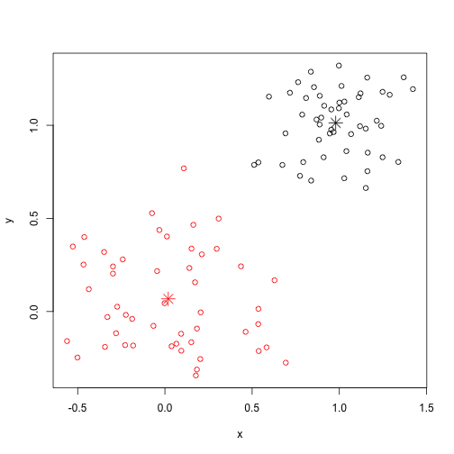
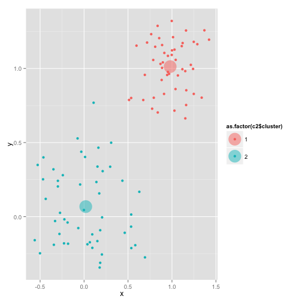

K-means example
========================================================


```r
require(graphics)
library(ggplot2)
# x is a matrix
x <- rbind(matrix(rnorm(100, sd = 0.3), ncol = 2), matrix(rnorm(100, mean = 1, 
    sd = 0.2), ncol = 2))
colnames(x) <- c("x", "y")

(c1 <- kmeans(x, 2))
```

```
## K-means clustering with 2 clusters of sizes 50, 50
## 
## Cluster means:
##         x       y
## 1 0.97934 1.01256
## 2 0.01929 0.06794
## 
## Clustering vector:
##   [1] 2 2 2 2 2 2 2 2 2 2 2 2 2 2 2 2 2 2 2 2 2 2 2 2 2 2 2 2 2 2 2 2 2 2 2
##  [36] 2 2 2 2 2 2 2 2 2 2 2 2 2 2 2 1 1 1 1 1 1 1 1 1 1 1 1 1 1 1 1 1 1 1 1
##  [71] 1 1 1 1 1 1 1 1 1 1 1 1 1 1 1 1 1 1 1 1 1 1 1 1 1 1 1 1 1 1
## 
## Within cluster sum of squares by cluster:
## [1] 3.693 8.878
##  (between_SS / total_SS =  78.3 %)
## 
## Available components:
## 
## [1] "cluster"      "centers"      "totss"        "withinss"    
## [5] "tot.withinss" "betweenss"    "size"
```


Plot it

```r
plot(x, col = c1$cluster)
points(c1$centers, col = 1:2, pch = 8, cex = 2)
```

 


```r
y <- as.data.frame(x)
c2 <- kmeans(y, 2)
mypoints <- as.data.frame(c2$centers)
mypoints$col <- as.factor(1:2)

ggplot(y, aes(x, y, color = as.factor(c2$cluster))) + geom_point() + geom_point(data = mypoints, 
    aes(x, y, color = col), size = 10, alpha = 0.5)
```

 


sum of squares

```r
ss <- function(x) sum(scale(x, scale = FALSE)^2)
```


