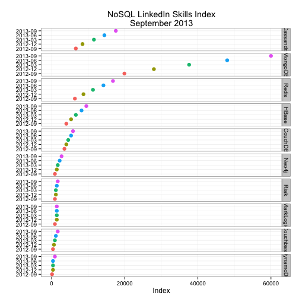

Manually reorder factor variables and plot as facets
========================================================


```r
library(ggplot2)

# read in the CSV file
nosql.df <- read.csv("nosql.csv", header = TRUE)
# manually order facets
nosql.df$Database <- factor(nosql.df$Database, levels = c("Cassandra", "MongoDB", 
    "Redis", "HBase", "CouchDB", "Neo4j", "Riak", "MarkLogic", "Couchbase", 
    "DynamoDB"))

# start the plot
gg <- ggplot(data = nosql.df, aes(x = Quarter, y = Index))
# use points, colored by Quarter
gg <- gg + geom_point(aes(color = Quarter), size = 3)
# make strips by nosql db factor
gg <- gg + facet_grid(Database ~ .)
# rotate the plot
gg <- gg + coord_flip()
# get rid of most of the junk
gg <- gg + theme_bw()
# add a title
gg <- gg + labs(x = "", title = "NoSQL LinkedIn Skills Index\nSeptember 2013")
# get rid of the legend
gg <- gg + theme(legend.position = "none")
# ensure the strip is gone
gg <- gg + theme(strip.text.x = element_blank())
gg
```

 

