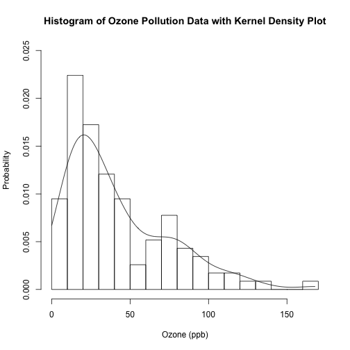
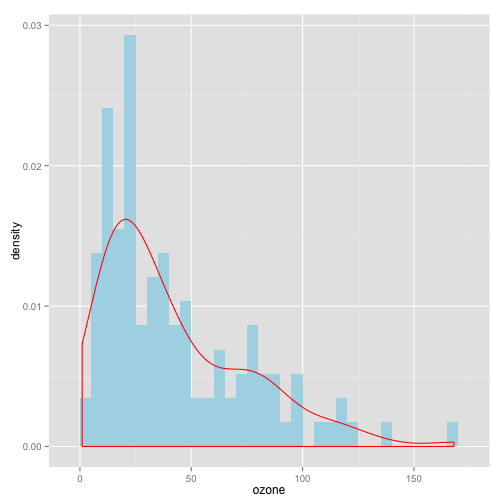
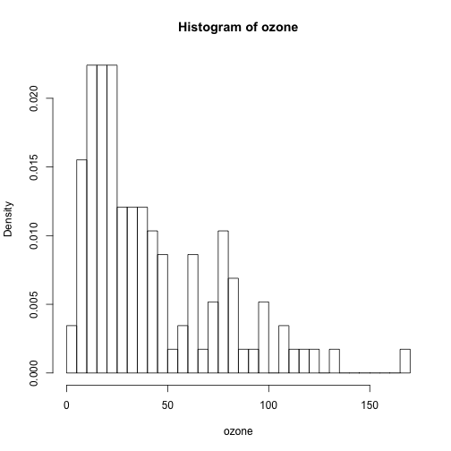
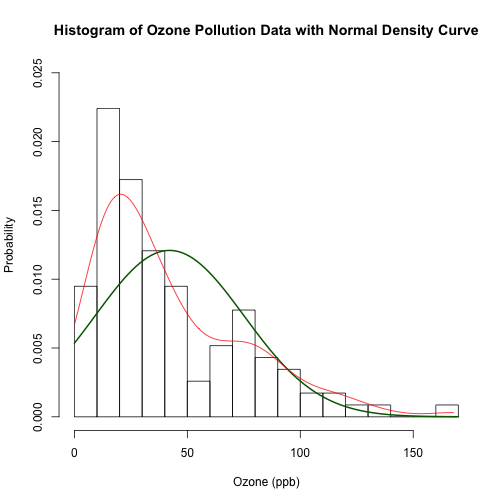
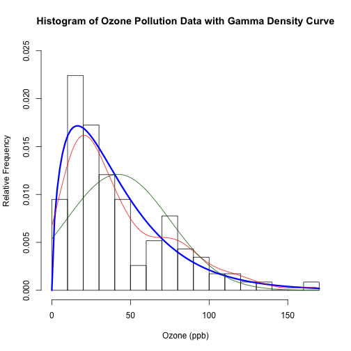
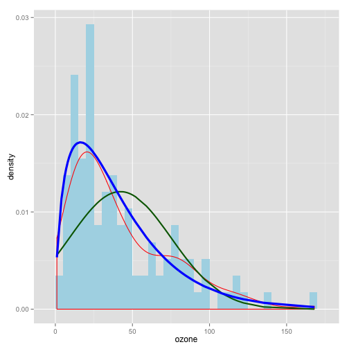

Ozone - Combine Histogram and Density Plots
========================================================

http://www.r-bloggers.com/exploratory-data-analysis-combining-histograms-and-density-plots-to-examine-the-distribution-of-the-ozone-pollution-data-from-new-york-in-r/

##### Exploratory Data Analysis of Ozone Pollution Data in New York
##### By Eric Cai - The Chemical Statistician

## Setup

```r
rm(list = ls())
rm(list = ls(all.names = TRUE))

# view first 6 entries of the 'Ozone' data frame
head(airquality)
```

```
##   Ozone Solar.R Wind Temp Month Day
## 1    41     190  7.4   67     5   1
## 2    36     118  8.0   72     5   2
## 3    12     149 12.6   74     5   3
## 4    18     313 11.5   62     5   4
## 5    NA      NA 14.3   56     5   5
## 6    28      NA 14.9   66     5   6
```

```r

# extract 'Ozone' data vector
ozone = airquality$Ozone

# sample size of 'ozone'
length(ozone)
```

```
## [1] 153
```

```r

# summary of 'ozone'
summary(ozone)
```

```
##    Min. 1st Qu.  Median    Mean 3rd Qu.    Max.    NA's 
##     1.0    18.0    31.5    42.1    63.2   168.0      37
```


### 3 ways to find number of non-missing values in "ozone"

```r
length(ozone[is.na(ozone) == F])
```

```
## [1] 116
```

```r
length(ozone[!is.na(ozone)])
```

```
## [1] 116
```

```r
n = sum(!is.na(ozone))
```


### calculate mean, variance and standard deviation of "ozone" by excluding missing values

```r
mean.ozone = mean(ozone, na.rm = T)
var.ozone = var(ozone, na.rm = T)
sd.ozone = sd(ozone, na.rm = T)

var(ozone, na.rm = T)
```

```
## [1] 1088
```

```r
sd(ozone, na.rm = T)
```

```
## [1] 32.99
```

```r
max.ozone = max(ozone, na.rm = T)
```


* Notice my use of the lines() function to add the kernel density plot.
* Ozone concentration is a non-negative quantity.  Thus, I wrote the “from = 0″ and “to = max.ozone” options in the density() function to ensure that the support set of the kernel density plot is non-negative.
* By default, the density() function uses the Gaussian kernel.  The bandwidth is much more important in determining the kernel density estimate.

### histogram with kernel density estimate

```r
# png('INSERT YOUR DIRECTORY PATH HERE/histogram and kernel density
# plot.png')
hist(ozone, breaks = 15, freq = F, xlab = "Ozone (ppb)", ylim = c(0, 0.025), 
    ylab = "Probability", main = "Histogram of Ozone Pollution Data with Kernel Density Plot")
lines(density(ozone, na.rm = T, from = 0, to = max.ozone))
```

 

```r
# dev.off()
```


Try using ggplot

```r
g <- ggplot(subset(data.frame(ozone), !is.na(ozone)), aes(ozone, ..density..)) + 
    geom_histogram(binwidth = 5, fill = "lightblue") + geom_density(color = "red")
g
```

 


## Try to find a parametric distribution that fits the data

### Start with Normal

* Use of the dnorm() function to get the normal density values.  
* Use the sample mean and sample standard deviation as calculated above to define this particular normal distribution.
* Calculate a vector called “ozone.ylim.normal” to get the lowest and largest values of both the histogram and the normal density.  
* Use it in the y-axis limits of the histogram by setting ylim = ozone.ylim.normal so that the y-values of both the histogram and the normal density curve would be within the vertical limits of the plot.  Strangely, the y-axis did not extend to the maximum of the histogram.  (Try it yoursefl!)  After examining the resulting histogram, I saw that an upper vertical limit of  0.025 would be suitable, so that’s what I used in the ylim option.  ozone.ylim.normal was not eventually used for any purpose, but it has been computed here for your own exploration should you wish to do so.
* Note my use of the curve() function to plot this normal density curve.


```r
# histogram with normal density curve png('INSERT YOUR DIRECTORY PATH
# HERE/histogram and normal density plot.png')
ozone.histogram = hist(ozone, breaks = 50, freq = F)
```

 

```r
ozone.ylim.normal = range(0, ozone.histogram$density, dnorm(ozone, mean = mean.ozone, 
    sd = sd.ozone), na.rm = T)
hist(ozone, breaks = 15, freq = F, ylim = c(0, 0.025), xlab = "Ozone (ppb)", 
    ylab = "Probability", main = "Histogram of Ozone Pollution Data with Normal Density Curve")
curve(dnorm(x, mean = mean.ozone, sd = sd.ozone), add = T, col = "darkgreen", 
    lwd = 2)
lines(density(ozone, na.rm = T, from = 0, to = max.ozone), col = "red", lwd = 1)
```

 

```r
# dev.off()
```


### Try Gamma Distribution

Notice how the histogram rises quickly for low values of ozone concentration, then decreases gradually.  The gamma distribution has this behaviour; let’s give that a try!  However, in order to define the gamma function, we need a way to estimate the parameters.

$$f(x; k; \theta) = \theta^{-k}\Gamma(k)^{-1}exp(x\theta^{-1}) \\
x > 0 \\
k > 0 \quad\mbox{shape parameter}, \\
\theta > 0 \quad\mbox{scale parameter}$$


$$E(X) = k \theta \\
Var(X) = k\theta^2$$

Use sample mean and sample variance to estimate shape and scale parameters.
$$\hat{k} = \frac{\bar{X}^2}{s^2} \\
\hat{\theta} = \frac{s^2}{\bar{X}}
$$

### histogram with gamma density curve

```r
# png('INSERT YOUR DIRECTORY PATH HERE/histogram and normal density
# plot.png')
hist(ozone, breaks = 15, freq = F, xlim = c(0, 170), ylim = c(0, 0.025), xlab = "Ozone (ppb)", 
    ylab = "Relative Frequency", main = "Histogram of Ozone Pollution Data with Gamma Density Curve")

# add gamma density
curve(dgamma(x, shape = mean.ozone^2/var.ozone, scale = var.ozone/mean.ozone), 
    add = T, col = "blue", lwd = 3)

# add kernel density
lines(density(ozone, na.rm = T, from = 0, to = max.ozone), col = "red", lwd = 1)

# add normal density
curve(dnorm(x, mean = mean.ozone, sd = sd.ozone), add = T, col = "darkgreen", 
    lwd = 1)
```

 

```r
# dev.off()
```

* blue = gamma distribution
* red = kernel distribution
* green = normal distribution

This is clearly a better fit than the normal density curve, and it is closer to the kernel density plot, too!  (The kernel density plot detects the local maximum at about 75 ppb and has a small “bump” there as a result; the gamma distribution does not have such an accommodation.)

Try using ggplot

```r
all_data <- data.frame(subset(data.frame(ozone), !is.na(ozone)))
all_data <- mutate(all_data, norm = dnorm(ozone, mean = mean.ozone, sd = sd.ozone), 
    g = dgamma(ozone, shape = mean.ozone^2/var.ozone, scale = var.ozone/mean.ozone))

g <- ggplot(all_data, aes(ozone, ..density..)) + geom_histogram(binwidth = 5, 
    fill = "lightblue") + geom_density(color = "red")
g + geom_line(aes(y = norm), colour = "darkgreen", size = 1) + geom_line(aes(y = g), 
    colour = "blue", size = 1.5)
```

 

