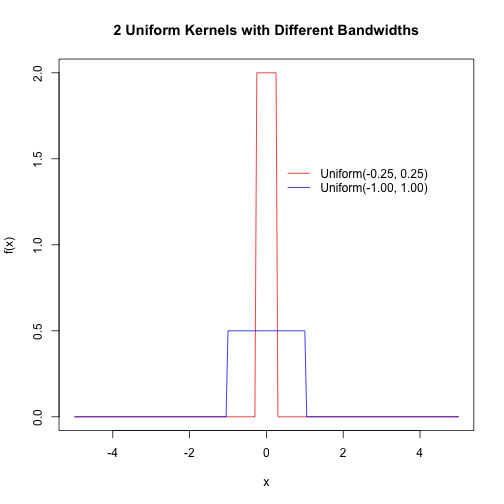
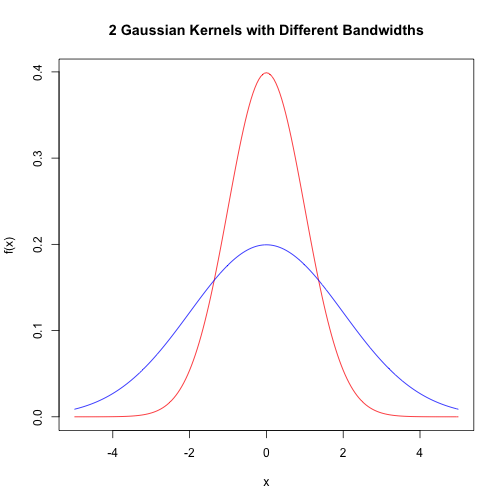

Plot 2 uniform Kernel Functions with Different Bandwidths
========================================================

http://chemicalstatistician.wordpress.com/2013/06/09/exploratory-data-analysis-kernel-density-estimation-in-r-on-ozone-pollution-data-in-new-york-and-ozonopolis/

Define support set of X

```r
x <- seq(-5, 5, by = 0.05)
```


## Uniform Kernel

Obtain uniform kernel function values

```r
uniform1 <- dunif(x, min = -0.25, max = 0.25)
uniform2 <- dunif(x, min = -1, max = 1)
```


```r
plot(x, uniform1, type = "l", ylab = "f(x)", xlab = "x", main = "2 Uniform Kernels with Different Bandwidths", 
    col = "red")

# add plot of second kernel function
lines(x, uniform2, col = "blue")

# add legend
legend(0.28, 1.5, c("Uniform(-0.25, 0.25)", "Uniform(-1.00, 1.00)"), lty = c(1, 
    1), col = c("red", "blue"), box.lwd = 0)
```

 


## Gaussian Kernel

Obtain norm kernel function values

```r
norm1 <- dnorm(x, mean = 0, sd = 1)
norm2 <- dnorm(x, mean = 0, sd = 2)
```


```r
plot(x, norm1, type = "l", ylab = "f(x)", xlab = "x", main = "2 Gaussian Kernels with Different Bandwidths", 
    col = "red")

# add plot of second kernel function
lines(x, norm2, col = "blue")

# add legend
legend(0.28, 1.5, c("Normal(0, 1)", "Normal(0, 2)"), lty = c(1, 1), col = c("red", 
    "blue"), box.lwd = 0)
```

 


