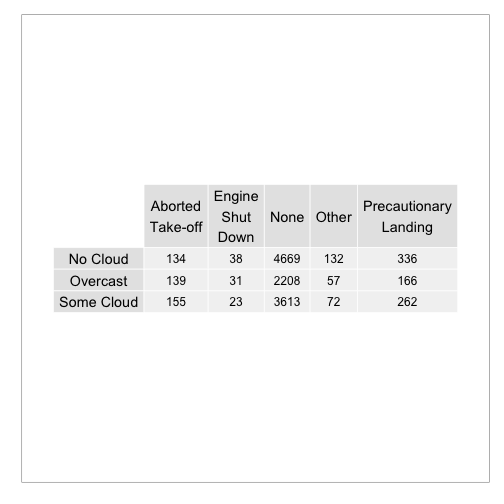

Tables as graphics
========================================================

## Load libraries & data

```r
library(OIdata)
```

```
## Loading required package: RCurl Loading required package: bitops Loading
## required package: maps
```

```r
data(birds)
library(ggplot2)
library(gridExtra)
```

```
## Loading required package: grid
```


## Some munging

```r
head(birds)
```

```
##   opid                 operator      atype                remarks
## 1  AAL        AMERICAN AIRLINES      MD-80              NO DAMAGE
## 2  USA               US AIRWAYS FK-28-4000    2 BIRDS, NO DAMAGE.
## 3  AAL        AMERICAN AIRLINES  B-727-200                   <NA>
## 4  AAL        AMERICAN AIRLINES      MD-82                   <NA>
## 5  AAL        AMERICAN AIRLINES      MD-82              NO DAMAGE
## 6  GFT GULFSTREAM INTL AIRLINES      BE-99 FLT 714.  TIME = 1951Z
##   phase_of_flt ac_mass num_engs               date time_of_day state
## 1      Descent       4        2  9/30/1990 0:00:00       Night    IL
## 2        Climb       4        2 11/29/1993 0:00:00         Day    MD
## 3     Approach       4        3  8/13/1993 0:00:00         Day    TN
## 4        Climb       4        2  10/7/1993 0:00:00         Day    VA
## 5        Climb       4        2  9/25/1993 0:00:00         Day    SC
## 6 Landing Roll       2        2  9/20/1993 0:00:00         Day    FL
##   height speed effect        sky               species birds_seen
## 1   7000   250   <NA>   No Cloud UNKNOWN BIRD - MEDIUM       <NA>
## 2     10   140   None   No Cloud UNKNOWN BIRD - MEDIUM       2-10
## 3    400   140   None Some Cloud  UNKNOWN BIRD - SMALL       2-10
## 4    100   200   None   Overcast  UNKNOWN BIRD - SMALL       <NA>
## 5     50   170   None Some Cloud  UNKNOWN BIRD - SMALL       2-10
## 6      0    40   None Some Cloud                 HAWKS       <NA>
##   birds_struck
## 1            1
## 2         2-10
## 3            1
## 4            1
## 5            1
## 6            1
```

```r
str(birds)
```

```
## 'data.frame':	19302 obs. of  17 variables:
##  $ opid        : Factor w/ 285 levels "AAA","AAH*","AAL",..: 3 264 3 3 3 118 180 195 3 166 ...
##  $ operator    : Factor w/ 285 levels "ABX AIR (was AIRBORNE EXPRESS)",..: 43 265 43 43 43 137 191 202 43 171 ...
##  $ atype       : Factor w/ 284 levels "A-300","A-310",..: 219 174 21 221 221 71 147 7 21 45 ...
##  $ remarks     : chr  "NO DAMAGE" "2 BIRDS, NO DAMAGE." NA NA ...
##  $ phase_of_flt: Factor w/ 8 levels "Approach","Climb",..: 3 2 1 2 2 5 4 2 1 1 ...
##  $ ac_mass     : int  4 4 4 4 4 2 4 2 4 2 ...
##  $ num_engs    : int  2 2 3 2 2 2 2 1 3 2 ...
##  $ date        : chr  "9/30/1990 0:00:00" "11/29/1993 0:00:00" "8/13/1993 0:00:00" "10/7/1993 0:00:00" ...
##  $ time_of_day : Factor w/ 4 levels "Dawn","Day","Dusk",..: 4 2 2 2 2 2 4 2 2 3 ...
##  $ state       : Factor w/ 58 levels "AB","AK","AL",..: 17 23 49 52 47 12 32 NA 51 50 ...
##  $ height      : num  7000 10 400 100 50 0 4000 100 200 3000 ...
##  $ speed       : num  250 140 140 200 170 40 230 50 130 NA ...
##  $ effect      : Factor w/ 5 levels "Aborted Take-off",..: NA 3 3 3 3 3 3 NA 3 3 ...
##  $ sky         : Factor w/ 3 levels "No Cloud","Overcast",..: 1 1 3 2 3 3 3 1 1 NA ...
##  $ species     : Factor w/ 241 levels "AMERICAN ALLIGATOR",..: 214 214 215 215 215 111 212 110 214 212 ...
##  $ birds_seen  : Factor w/ 3 levels "11-100","2-10",..: NA 2 2 NA 2 NA NA 2 NA NA ...
##  $ birds_struck: Factor w/ 5 levels "0","1","11-100",..: 2 4 2 2 2 2 2 4 2 2 ...
```

```r

# line breaks between words for levels of birds$effects
levels(birds$effect) <- gsub(" ", "\n", levels(birds$effect))
```


Make table

```r
xyTable <- table(birds$sky, birds$effect)
xyTable
```

```
##             
##              Aborted\nTake-off Engine\nShut\nDown None Other
##   No Cloud                 134                 38 4669   132
##   Overcast                 139                 31 2208    57
##   Some Cloud               155                 23 3613    72
##             
##              Precautionary\nLanding
##   No Cloud                      336
##   Overcast                      166
##   Some Cloud                    262
```


Use qplot to create empty plt, center table in it, use tableGrob to display the table

```r
qplot(1:10, 1:10, geom='blank') + theme_bw() +
  theme(line = element_blank(), text=element_blank()) +
  annotation_custom(grob = tableGrob(xyTable,
      # change font sizes:
      gpar.coltext = gpar(cex=1.2),
      gpar.rowtext = gpar(cex=1.2)),
      xmin=-Inf, xmax= Inf, ymin= -Inf, ymax= Inf)
```

 


