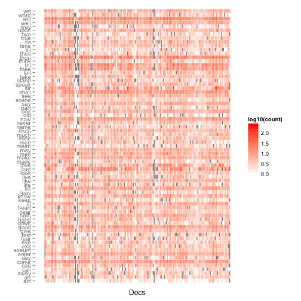

Text Mine Complete Works of William Shakespeare
========================================================

http://www.r-bloggers.com/text-mining-the-complete-works-of-william-shakespeare/?utm_source=feedburner&utm_medium=email&utm_campaign=Feed%3A+RBloggers+%28R+bloggers%29

## Load

```r
textfile <- "data/pg100.txt"
if (!file.exists(textfile)) {
    download.file("http://www.gutenberg.org/cache/epub/100/pg100.txt", destfile = textfile)
}
shakespeare = readLines(textfile)
length(shakespeare)
```

```
## [1] 124787
```

```r
head(shakespeare)
```

```
## [1] "The Project Gutenberg EBook of The Complete Works of William Shakespeare, by"
## [2] "William Shakespeare"                                                         
## [3] ""                                                                            
## [4] "This eBook is for the use of anyone anywhere at no cost and with"            
## [5] "almost no restrictions whatsoever.  You may copy it, give it away or"        
## [6] "re-use it under the terms of the Project Gutenberg License included"
```

```r
tail(shakespeare)
```

```
## [1] "http://www.gutenberg.org/2/4/6/8/24689"   
## [2] ""                                         
## [3] "An alternative method of locating eBooks:"
## [4] "http://www.gutenberg.org/GUTINDEX.ALL"    
## [5] ""                                         
## [6] "*** END: FULL LICENSE ***"
```


## Munge
Remove metadata, and concatenate the rest into one long string

```r
shakespeare <- shakespeare[-(1:173)]
shakespeare <- shakespeare[-(124195:length(shakespeare))]
shakespeare <- paste(shakespeare, collapse = " ")
nchar(shakespeare)
```

```
## [1] 5436541
```


While I had the text open in the editor I noticed that sections in the document were separated by the following text:

\<\<THIS ELECTRONIC VERSION OF THE COMPLETE WORKS OF WILLIAM
SHAKESPEARE IS COPYRIGHT 1990-1993 BY WORLD LIBRARY, INC., AND IS
PROVIDED BY PROJECT GUTENBERG ETEXT OF ILLINOIS BENEDICTINE COLLEGE
WITH PERMISSION.  ELECTRONIC AND MACHINE READABLE COPIES MAY BE
DISTRIBUTED SO LONG AS SUCH COPIES (1) ARE FOR YOUR OR OTHERS
PERSONAL USE ONLY, AND (2) ARE NOT DISTRIBUTED OR USED
COMMERCIALLY.  PROHIBITED COMMERCIAL DISTRIBUTION INCLUDES BY ANY
SERVICE THAT CHARGES FOR DOWNLOAD TIME OR FOR MEMBERSHIP.\>\>

Obviously that is going to taint the analysis. But it also serves as a convenient marker to divide that long, long, long string into separate documents.


```r
# strsplit returns a list Take the first element (in this case there is only
# 1 element)
shakespeare <- strsplit(shakespeare, "<<[^>]*>>")[[1]]
length(shakespeare)
```

```
## [1] 218
```

```r
# Now, we have a 2nd list of 218 elements
```


This left me with a list of 218 documents. On further inspection, some of them appeared to be a little on the short side (in my limited experience, the bard is not known for brevity). As it turns out, the short documents were the dramatis personae for his plays. I removed them as well.

```r
(dramatis.personae <- grep("Dramatis Personae", shakespeare, ignore.case = TRUE))
```

```
##  [1]   2   8  11  17  23  28  33  43  49  55  62  68  74  81  87  93  99
## [18] 105 111 117 122 126 134 140 146 152 158 164 170 176 182 188 194 200
## [35] 206 212
```

```r
length(shakespeare)
```

```
## [1] 218
```

```r
shakespeare <- shakespeare[-dramatis.personae]
length(shakespeare)
```

```
## [1] 182
```


Down to 182 documents, each of which is a complete work.

The next task was to convert these documents into a corpus.

```r
# install.packages('tm')
library(tm)

doc.vec <- VectorSource(shakespeare)
doc.corpus <- Corpus(doc.vec)
summary(doc.corpus)
```

```
## A corpus with 182 text documents
## 
## The metadata consists of 2 tag-value pairs and a data frame
## Available tags are:
##   create_date creator 
## Available variables in the data frame are:
##   MetaID
```


There is a lot of information in those documents which is not particularly useful for text mining. So before proceeding any further, we will clean things up a bit. First we convert all of the text to lowercase and then remove punctuation, numbers and common English stopwords. Possibly the list of English stop words is not entirely appropriate for Shakespearean English, but it is a reasonable starting point.


```r
doc.corpus <- tm_map(doc.corpus, tolower)
doc.corpus <- tm_map(doc.corpus, removePunctuation)
doc.corpus <- tm_map(doc.corpus, removeNumbers)
doc.corpus <- tm_map(doc.corpus, removeWords, stopwords("english"))

# Next we perform stemming, which removes affixes from words (so, for
# example, “run”, “runs” and “running” all become “run”).
# install.packages('SnowballC')
library(SnowballC)
doc.corpus <- tm_map(doc.corpus, stemDocument)
doc.corpus <- tm_map(doc.corpus, stripWhitespace)

inspect(doc.corpus[8])
```

```
## A corpus with 1 text document
## 
## The metadata consists of 2 tag-value pairs and a data frame
## Available tags are:
##   create_date creator 
## Available variables in the data frame are:
##   MetaID 
## 
## [[1]]
##  act ii scene messina pompey hous enter pompey menecr mena warlik manner pompey great god just shall assist deed justest men menecr know worthi pompey delay deni pompey while suitor throne decay thing sue menecr ignor beg often harm wise powr deni us good find profit lose prayer pompey shall well peopl love sea mine power crescent augur hope say will come th full mark antoni egypt sit dinner will make war without door caesar get money lose heart lepidus flatter flatterd neither love either care mena caesar lepidus field mighti strength carri pompey tis fals mena silvius sir pompey dream know rome togeth look antoni charm love salt cleopatra soften thi wand lip let witchcraft join beauti lust tie libertin field feast keep brain fume epicurean cook sharpen cloyless sauc appetit sleep feed may prorogu honour even till leth dull enter varrius now varrius varrius certain shall deliv mark antoni everi hour rome expect sinc went egypt tis space farther travel pompey given less matter better ear mena think amor surfeit donnd helm petti war soldiership twice twain let us rear higher opinion stir can lap egypt widow pluck neerlustweari antoni mena hope caesar antoni shall well greet togeth wife that dead trespass caesar brother warrd upon although think movd antoni pompey know mena lesser enmiti may give way greater weret stand twere pregnant squar entertain caus enough draw sword fear us may cement divis bind petti differ yet know bet god will havet stand live upon use strongest hand come mena exeunt scene ii rome hous lepidus enter enobarbus lepidus lepidus good enobarbus tis worthi deed shall becom well entreat captain soft gentl speech enobarbus shall entreat answer like caesar move let antoni look caesar head speak loud mar jupit wearer antonius beard shavet today lepidus tis time privat stomach enobarbus everi time serv matter born int lepidus small greater matter must give way enobarbus small come first lepidus speech passion pray stir ember come nobl antoni enter antoni ventidius enobarbus yonder caesar enter caesar maecena agrippa antoni compos well parthia hark ventidius caesar know maecena ask agrippa lepidus nobl friend combind us great let leaner action rend us what amiss may gentl heard debat trivial differ loud commit murder heal wound nobl partner rather earnest beseech touch sourest point sweetest term curst grow th matter antoni tis spoken well arini fight thus flourish caesar welcom rome antoni thank caesar sit antoni sit sir caesar nay sit antoni learn take thing ill concern caesar must laughd noth littl say offend chiefli world laughd name derog sound name concernd antoni egypt caesar wast caesar resid rome might egypt yet practis state egypt might question antoni intend practisd caesar may pleasd catch mine intent befal wife brother made war upon contest theme word war antoni mistak busi brother never urg act inquir learn true report drew sword rather discredit author make war alik stomach alik caus letter satisfi youll patch quarrel matter whole make must caesar prais lay defect judgment patchd excus antoni know lack certain ont necess thought partner caus gainst fought grace eye attend war front mine peac wife spirit anoth third o th world snaffl may pace easi wife enobarbus wive men might go war women antoni much uncurb garboil caesar made impati want shrewd polici griev grant much disquiet must say help caesar wrote riot alexandria pocket letter taunt gibe missiv audienc antoni sir fell upon ere admit three king newli feast want th morn next day told much askd pardon let fellow noth strife contend question wipe caesar broken articl oath shall never tongu charg lepidus soft caesar antoni lepidus let speak honour sacr talk now suppos lackd caesar articl oath caesar lend arm aid requird deni antoni neglect rather poison hour bound mine knowledg near may ill play penit mine honesti shall make poor great power work without truth fulvia egypt made war ignor motiv far ask pardon befit mine honour stoop case lepidus tis nobl spoken maecena might pleas enforc grief ye forget quit rememb present need speak aton lepidus worthili spoken maecena enobarbus borrow one anoth love instant may hear word pompey return shall time wrangl noth els antoni thou art soldier speak enobarbus truth silent almost forgot antoni wrong presenc therefor speak enobarbus go consider stone caesar much dislik matter manner speech fort shall remain friendship condit diffr act yet knew hoop hold us stanch edg edg o th world pursu agrippa give leav caesar caesar speak agrippa agrippa thou hast sister mother side admird octavia great mark antoni now widow caesar say agrippa cleopatra heard reproof well deservd rash antoni marri caesar let hear agrippa speak agrippa hold perpetu amiti make brother knit heart unslip knot take antoni octavia wife whose beauti claim wors husband best men whose virtu whose general grace speak none els can utter marriag littl jealousi now seem great great fear now import danger noth truth tale now half tale truth love love draw pardon spoke tis studi present thought duti rumin antoni will caesar speak caesar till hear antoni touchd spoke alreadi antoni power agrippa say agrippa make good caesar power caesar power unto octavia antoni may never good purpos fair show dream impedi let thi hand act grace hour heart brother govern love sway great design caesar hand sister bequeath brother ever love dear let live join kingdom heart never fli love lepidus happili amen antoni think draw sword gainst pompey hath laid strang courtesi great late upon must thank lest remembr suffer ill report heel defi lepidus time call upon us must pompey present sought els seek us antoni lie caesar mount misenum antoni strength land caesar great increas sea absolut master antoni fame spoke togeth hast yet ere put arm dispatch busi talkd caesar glad invit sister view whither straight ill lead antoni let us lepidus lack compani lepidus nobl antoni sick detain flourish exeunt enobarbus agrippa maecena maecena welcom egypt sir enobarbus half heart caesar worthi maecena honour friend agrippa agrippa good enobarbus maecena caus glad matter well digest stayd well byt egypt enobarbus ay sir sleep day counten made night light drink maecena eight wild boar roast whole breakfast twelv person true enobarbus fli eagl much monstrous matter feast worthili deserv note maecena shes triumphant ladi report squar enobarbus first met mark antoni pursd heart upon river cydnus agrippa appeard inde report devisd well enobarbus will tell barg sat like burnishd throne burnd water poop beaten gold purpl sail perfum wind lovesick oar silver tune flute kept stroke made water beat follow faster amor stroke person beggard descript lie pavilion clothofgold tissu oerpictur venus see fanci outwork natur side stood pretti dimpl boy like smile cupid diverscolourd fan whose wind seem glow delic cheek cool undid agrippa o rare antoni enobarbus gentlewomen like nereid mani mermaid tend th eye made bend adorn helm seem mermaid steer silken tackl swell touch flowersoft hand yare frame offic barg strang invis perfum hit sens adjac wharf citi cast peopl upon antoni enthrond th marketplac sit alon whistl th air vacanc gone gaze cleopatra made gap natur agrippa rare egyptian enobarbus upon land antoni sent invit supper repli better becam guest entreat courteous antoni neer word woman heard speak barberd ten time oer goe feast ordinari pay heart eye eat agrippa royal wench made great caesar lay sword bed plough croppd enobarbus saw hop forti pace public street lost breath spoke pant make defect perfect breathless powr breath forth maecena now antoni must leav utter enobarbus never will age wither custom stale infinit varieti women cloy appetit feed make hungri satisfi vilest thing becom holi priest bless riggish maecena beauti wisdom modesti can settl heart antoni octavia bless lotteri agrippa let us go good enobarbus make guest whilst abid enobarbus humbl sir thank exeunt scene iii rome caesar hous enter antoni caesar octavia antoni world great offic will sometim divid bosom octavia time god knee shall bow prayer antoni good night sir octavia read blemish world report kept squar come shall done th rule good night dear ladi octavia good night sir caesar good night exeunt caesar octavia enter soothsay antoni now sirrah wish egypt soothsay never come thenc thither antoni can reason soothsay see motion tongu yet hie egypt antoni say whose fortun shall rise higher caesar mine soothsay caesar therefor o antoni stay side thi daemon thi spirit keep thee nobl courag high unmatch caesar near thi angel becom fear oerpowrd therefor make space enough antoni speak soothsay none thee thee thou dost play game thou art sure lose natur luck beat thee gainst odd thi lustr thicken shine say thi spirit afraid govern thee near away tis nobl antoni get thee gone say ventidius speak exit soothsay shall parthia art hap hath spoken true dice obey sport better cun faint chanc draw lot speed cock win battl still mine nought quail ever beat mine inhoopd odd will egypt though make marriag peac th east pleasur lie enter ventidius o come ventidius must parthia commiss readi follow receivet exeunt scene iv rome street enter lepidus maecena agrippa lepidus troubl pray hasten general agrippa sir mark antoni will een kiss octavia well follow lepidus till shall see soldier dress will becom farewel maecena shall conceiv journey th mount lepidus lepidus way shorter purpos draw much youll win two day upon sir good success lepidus farewel exeunt scene v alexandria cleopatra palac enter cleopatra charmian ira alexa cleopatra give music music moodi food us trade love music ho enter mardian eunuch cleopatra let alon let billiard come charmian charmian arm sore best play mardian cleopatra well woman eunuch playd woman come youll play sir mardian well can madam cleopatra good will showd thought come short actor may plead pardon ill none now give mine angl well th river music play far will betray tawnyfinnd fish bend hook shall pierc slimi jaw draw ill think everi one antoni say ah ha yare caught charmian twas merri wagerd angl diver hang salt fish hook fervenc drew cleopatra time o time laugh patienc night laughd patienc next morn ere ninth hour drunk bed put tire mantl whilst wore sword philippan enter messeng o itali ram thou thi fruit tide mine ear long time barren messeng madam madam cleopatra antoni dead thou say villain thou killst thi mistress well free thou yield gold bluest vein kiss hand king lippd trembl kiss messeng first madam well cleopatra there gold sirrah mark use say dead well bring gold give thee will melt pour thi illutt throat messeng good madam hear cleopatra well go will there good thi face antoni free health tart favour trumpet good tide well thou shouldst come like furi crownd snake like formal man messeng willt pleas hear cleopatra mind strike thee ere thou speakst yet thou say antoni live well friend caesar captiv ill set thee shower gold hail rich pearl upon thee messeng madam hes well cleopatra well said messeng friend caesar cleopatra thart honest man messeng caesar greater friend ever cleopatra make thee fortun messeng yet madam cleopatra like yet allay good preced fie upon yet yet gaoler bring forth monstrous malefactor prithe friend pour pack matter mine ear good bad togeth hes friend caesar state health thou sayst thou sayst free messeng free madam made report hes bound unto octavia cleopatra good turn messeng best turn th bed cleopatra pale charmian messeng madam hes marri octavia cleopatra infecti pestil upon thee strike messeng good madam patienc cleopatra say henc strike horribl villain ill spurn thine eye like ball ill unhair thi head hale thou shalt whippd wire stewd brine smart lingr pickl messeng gracious madam bring news made match cleopatra say tis provinc will give thee make thi fortun proud blow thou hadst shall make thi peac move rage will boot thee gift besid thi modesti can beg messeng hes marri madam cleopatra rogu thou hast livd long draw knife messeng nay ill run mean madam made fault exit charmian good madam keep within man innoc cleopatra innoc scape thunderbolt melt egypt nile kind creatur turn serpent call slave though mad will bite call charmian afeard come cleopatra will hurt hand lack nobil strike meaner sinc given caus enter messeng come hither sir though honest never good bring bad news give gracious messag host tongu let ill tide tell felt messeng done duti cleopatra marri hate thee worser thou say yes messeng hes marri madam cleopatra god confound thee dost thou hold still messeng lie madam cleopatra o thou didst half egypt submergd made cistern scald snake go get thee henc hadst thou narcissus thi face thou wouldst appear ugli marri messeng crave high pardon cleopatra marri messeng take offenc offend punish make seem much unequ hes marri octavia cleopatra o fault make knave thee art thart sure get thee henc merchandis thou hast brought rome dear lie upon thi hand undon em exit messeng charmian good high patienc cleopatra prais antoni dispraisd caesar charmian mani time madam cleopatra paid fort now lead henc faint o ira charmian tis matter go fellow good alexa bid report featur octavia year inclin let leav colour hair bring word quick exit alexa let ever go let charmian though paint one way like gorgon way mar mardian bid alexa bring word tall piti charmian speak lead chamber exeunt scene vi near misenum flourish enter pompey mena one door drum trumpet anoth caesar antoni lepidus enobarbus maecena agrippa soldier march pompey hostag mine shall talk fight caesar meet first come word therefor written purpos us sent thou hast consid let us know twill tie thi discont sword carri back sicili much tall youth els must perish pompey three senat alon great world chief factor god know wherefor father reveng want son friend sinc julius caesar philippi good brutus ghost saw labour wast movd pale cassius conspir made allhonourd honest roman brutus armd rest courtier beauteous freedom drench capitol one man man hath made rig navi whose burden angerd ocean foam meant scourg th ingratitud despit rome cast nobl father caesar take time antoni thou canst fear us pompey thi sail well speak thee sea land thou knowst much oercount thee pompey land inde thou dost oercount father hous sinc cuckoo build remain int thou mayst lepidus pleasd tell us present take offer sent caesar there point antoni entreat weigh worth embracd caesar may follow tri larger fortun pompey made offer sicili sardinia must rid sea pirat send measur wheat rome greed upon part unhackd edg bear back targ undint that offer pompey know came man prepard take offer mark antoni put impati though lose prais tell must know caesar brother blow mother came sicili find welcom friend antoni heard pompey well studi liber thank owe pompey let hand think sir met antoni bed th east soft thank calld timeli purpos hither gain byt caesar sinc saw last chang upon pompey well know count harsh fortun cast upon face bosom shall never come make heart vassal lepidus well met pompey hope lepidus thus agre crave composit may written seald us caesar that next pompey well feast ere part let draw lot shall begin antoni will pompey pompey antoni take lot first last fine egyptian cookeri shall fame heard julius caesar grew fat feast antoni heard much pompey fair mean sir antoni fair word pompey much heard heard apollodorus carri enobarbus pompey pray enobarbus certain queen caesar mattress pompey know thee now farst thou soldier enobarbus well well like perceiv four feast toward pompey let shake thi hand never hate thee seen thee fight envi thi behaviour enobarbus sir never lovd much ha praisd ye well deservd ten time much said pompey enjoy thi plain noth ill becom thee aboard galley invit will lead lord show way sir pompey come exeunt enobarbus mena mena asid thi father pompey neer made treati known sir enobarbus sea think mena sir enobarbus done well water mena land enobarbus will prais man will prais though deni done land mena done water enobarbus yes someth can deni safeti great thief sea mena land enobarbus deni land servic give hand mena eye author might take two thiev kiss mena men face true whatsom hand enobarbus never fair woman true face mena slander steal heart enobarbus came hither fight mena part sorri turnd drink pompey doth day laugh away fortun enobarbus sure weept back mena yhave said sir lookd mark antoni pray marri cleopatra enobarbus caesar sister calld octavia mena true sir wife caius marcellus enobarbus now wife marcus antonius mena pray ye sir enobarbus tis true mena caesar ever knit togeth enobarbus bound divin uniti prophesi mena think polici purpos made marriag love parti enobarbus think shall find band seem tie friendship togeth will strangler amiti octavia holi cold still convers mena wife enobarbus mark antoni will egyptian dish shall sigh octavia blow fire caesar said strength amiti shall prove immedi author varianc antoni will use affect marri occas mena thus may come sir will aboard health enobarbus shall take sir usd throat egypt mena come let away exeunt actsc scene vii board pompey galley misenum music play enter two three servant banquet first servant theyll man o plant illroot alreadi least wind th world will blow second servant lepidus highcolourd first servant made drink almsdrink second servant pinch one anoth disposit cri reconcil entreati th drink first servant rais greater war discret second servant name great men fellowship lief reed will servic partizan heav first servant calld huge sphere seen move int hole eye piti disast cheek sennet sound enter caesar antoni lepidus pompey agrippa maecena enobarbus mena captain antoni caesar thus sir take flow o th nile certain scale th pyramid know th height low mean dearth foison follow higher nilus swell promis ebb seedsman upon slime ooz scatter grain short come harvest lepidus yhave strang serpent antoni ay lepidus lepidus serpent egypt bred now mud oper sun crocodil antoni pompey sit wine health lepidus lepidus well ill neer enobarbus till slept fear youll till lepidus nay certain heard ptolemi pyramis good thing without contradict heard mena asid pompey pompey word pompey asid mena say mine ear ist mena asid pompey forsak thi seat beseech thee captain hear speak word pompey whisper in ear forbear till anon wine lepidus lepidus manner o thing crocodil antoni shapd sir like broad hath breadth just high move organ live nourisheth element transmigr lepidus colour antoni colour lepidus tis strang serpent antoni tis tear wet caesar will descript satisfi antoni health pompey give els epicur pompey asid mena go hang sir hang tell away bid where cup calld mena asid pompey sake merit thou wilt hear rise thi stool pompey asid mena think thart mad rise walk asid matter mena ever held cap thi fortun pompey thou hast servd much faith what els say jolli lord antoni quicksand lepidus keep sink mena wilt thou lord world pompey sayst thou mena wilt thou lord whole world that twice pompey mena entertain though think poor man will give thee world pompey hast thou drunk well mena pompey kept cup thou art thou darst earth jove whateer ocean pale sky inclip thine thou wilt hat pompey show way mena three worldshar competitor thi vessel let cut cabl put fall throat thine pompey ah thou shouldst done spoke ont tis villaini theet good servic thou must know tis profit lead mine honour mine honour repent eer thi tongu hath betrayd thine act done unknown found afterward well done must condemn now desist drink mena asid ill never follow thi palld fortun seek will take tis offerd shall never find pompey health lepidus antoni bear ashor ill pledg pompey enobarbus here thee mena mena enobarbus welcom pompey fill till cup hid enobarbus there strong fellow mena point servant carri lepidus mena enobarbus bear third part world man seest mena third part drunk might go wheel enobarbus drink thou increas reel mena come pompey yet alexandrian feast antoni ripen toward strike vessel ho here caesar caesar well forbeart monstrous labour wash brain grow fouler antoni child o th time caesar possess ill make answer rather fast four day drink much one enobarbus antoni ha brave emperor shall danc now egyptian bacchan celebr drink pompey let hat good soldier antoni come let take hand till conquer wine hath steepd sens soft delic leth enobarbus take hand make batteri ear loud music ill place boy shall sing hold everi man shall bear loud strong side can volley music play enobarbus place hand hand song come thou monarch vine plumpi bacchus pink eyn thi fat care drownd thi grape hair crownd cup us till world go round cup us till world go round caesar pompey good night good brother let request graver busi frown leviti gentl lord let part see burnt cheek strong enobarb weaker wine mine tongu split speak wild disguis hath almost antickd us need word good night good antoni hand pompey ill tri shore antoni shall sir give hand pompey o antoni father hous friend come boat enobarbus take heed fall exeunt enobarbus mena mena ill shore mena cabin drum trumpet flute let neptun hear bid loud farewel great fellow sound hangd sound sound flourish drum enobarbus hoo say there cap mena hoo nobl captain come exeunt actsc act iii scene plain syria enter ventidius triumph silius roman offic soldier dead bodi pacorus born ventidius now dart parthia art thou struck now pleasd fortun marcus crassus death make reveng bear king son bodi armi thi pacorus orod pay marcus crassus silius nobl ventidius whilst yet parthian blood thi sword warm fugit parthian follow spur media mesopotamia shelter whither rout fli thi grand captain antoni shall set thee triumphant chariot put garland thi head ventidius o silius silius done enough lower place note well may make great act learn silius better leav undon deed acquir high fame serv away caesar antoni ever won offic person sossius one place syria lieuten quick accumul renown achievd th minut lost favour th war captain can becom captain captain ambit soldier virtu rather make choic loss gain darken antonius good twould offend offenc perform perish silius thou hast ventidius without soldier sword grant scarc distinct thou wilt write antoni ventidius ill humbl signifi name magic word war effect banner wellpaid rank neeryetbeaten hors parthia jade o th field silius now ventidius purposeth athen whither hast weight must convey with will permit shall appear pass along exeunt actsc scene ii rome caesar hous enter agrippa one door enobarbus anoth agrippa brother part enobarbus dispatchd pompey gone three seal octavia weep part rome caesar sad lepidus sinc pompey feast mena say troubl green sick agrippa tis nobl lepidus enobarbus fine one o love caesar agrippa nay dear ador mark antoni enobarbus caesar hes jupit men agrippa what antoni god jupit enobarbus spake caesar nonpareil agrippa o antoni o thou arabian bird enobarbus prais caesar say caesar go agrippa inde pli excel prais enobarbus love caesar best yet love antoni hoo heart tongu figur scribe bard poet think speak cast write sing number hoo love antoni caesar kneel kneel wonder agrippa love enobarbus shard beetl trumpet within hors adieu nobl agrippa agrippa good fortun worthi soldier farewel enter caesar antoni lepidus octavia antoni sir caesar take great part use well int sister prove wife thought make thee farthest band shall pass thi approof nobl antoni let piec virtu set betwixt us cement love keep build ram batter fortress better might lovd without mean part cherishd antoni make offend distrust caesar said antoni shall find though therein curious least caus seem fear god keep make heart roman serv end will part caesar farewel dearest sister fare thee well element kind thee make thi spirit comfort fare thee well octavia nobl brother antoni april eye love spring shower bring cheer octavia sir look well husband hous caesar octavia octavia ill tell ear antoni tongu will obey heart can heart inform tongu swan feather stand upon swell full tide neither way inclin enobarbus asid agrippa will caesar weep agrippa asid enobarbus cloud in face enobarbus asid agrippa wors hors man agrippa asid enobarbus enobarbus antoni found julius caesar dead cri almost roar wept philippi found brutus slain enobarbus asid agrippa year inde troubl rheum will confound waild believet till weep caesar sweet octavia shall hear still time shall outgo think antoni come sir come ill wrestl strength love look thus let go give god caesar adieu happi lepidus let number star give light thi fair way caesar farewel farewel kiss octavia antoni farewel trumpet sound exeunt actsc scene iii alexandria cleopatra palac enter cleopatra charmian ira alexa cleopatra fellow alexa half afeard come cleopatra go go enter messeng come hither sir alexa good majesti herod jewri dare look upon well pleasd cleopatra herod head ill antoni gone might command come thou near messeng gracious majesti cleopatra didst thou behold octavia messeng ay dread queen cleopatra messeng madam rome lookd face saw led brother mark antoni cleopatra tall messeng madam cleopatra didst hear speak shrilltongud low messeng madam heard speak lowvoicd cleopatra that good like long charmian like o isi tis imposs cleopatra think charmian dull tongu dwarfish majesti gait rememb eer thou lookdst majesti messeng creep motion station one show bodi rather life statu breather cleopatra certain messeng observ charmian three egypt make better note cleopatra hes know perceivet there noth yet fellow good judgment charmian excel cleopatra guess year prithe messeng madam widow cleopatra widow charmian hark messeng think shes thirti cleopatra bearst thou face mind ist long round messeng round even faulti cleopatra part foolish hair colour messeng brown madam forehead low wish cleopatra there gold thee thou must take former sharp ill will employ thee back find thee fit busi go make thee readi letter prepard exeunt messeng charmian proper man cleopatra inde repent much harri methink creatur thing charmian noth madam cleopatra man hath seen majesti know charmian hath seen majesti isi els defend serv long cleopatra one thing ask yet good charmian tis matter thou shalt bring will write may well enough charmian warrant madam exeunt actsc scene iv athen antoni hous enter antoni octavia antoni nay nay octavia excus thousand semblabl import hath wagd new war gainst pompey made will read public ear spoke scandi perforc pay term honour cold sick vent narrow measur lent best hint given tookt teeth octavia o good lord believ must believ stomach unhappi ladi divis chanc neer stood pray part good god will mock present shall pray o bless lord husband undo prayer cri loud o bless brother husband win win brother pray destroy prayer midway twixt extrem antoni gentl octavia let best love draw point seek best preserv lose mine honour lose better branchless request shall go between meantim ladi ill rais prepar war shall stain brother make soonest hast desir octavia thank lord jove power make weak weak reconcil war twixt twain world cleav slain men solder rift antoni appear begin turn displeasur way fault can never equal love can equal move provid go choos compani command cost heart mind exeunt actsc scene v athen antoni hous enter enobarbus ero meet enobarbus now friend ero ero there strang news come sir enobarbus man ero caesar lepidus made war upon pompey enobarbus old success ero caesar made use war gainst pompey present deni rival let partak glori action rest accus letter former wrote pompey upon appeal seiz poor third till death enlarg confin enobarbus world thou hast pair chap throw food thou hast theyll grind one where antoni ero hes walk garden thus spurn rush lie cri fool lepidus threat throat offic murdr pompey enobarbus great navi riggd ero itali caesar domitius lord desir present news might told hereaft enobarbus twill naught let bring antoni ero come sir exeunt actsc scene vi rome caesar hous enter caesar agrippa maecena caesar contemn rome done alexandria here manner oft th marketplac tribun silverd cleopatra chair gold public enthrond feet sat caesarion call father son unlaw issu lust sinc hath made unto gave stablish egypt made lower syria cyprus lydia absolut queen maecena public eye caesar th common showplac exercis son proclaimd king king great media parthia armenia gave alexand ptolemi assignd syria cilicia phoenicia th habili goddess isi day appeard oft gave audienc tis report maecena let rome thus informd agrippa queasi insol alreadi will good thought call caesar peopl know now receivd accus agrippa accus caesar caesar sicili sextus pompeius spoild rate part o th isl say lent ship unrestord last fret lepidus triumvir deposd detain revenu agrippa sir answerd caesar tis done alreadi messeng gone told lepidus grown cruel high author abusd deserv chang conquerd grant part armenia conquerd kingdom demand like maecena hell never yield caesar must yield enter octavia train octavia hail caesar lord hail dear caesar caesar ever call thee castaway octavia calld caus caesar stoln upon us thus come like caesar sister wife antoni armi usher neigh hors tell approach long ere appear tree th way born men expect faint long nay dust ascend roof heaven raisd popul troop come marketmaid rome prevent ostent love left unshown often left unlovd met sea land suppli everi stage augment greet octavia good lord come thus constraind free will lord mark antoni hear prepard war acquaint griev ear withal whereon beggd pardon return caesar soon grant obstruct tween lust octavia say lord caesar eye upon affair come wind now octavia lord athen caesar wrong sister cleopatra hath nod hath given empir whore now levi king o th earth war hath assembl bocchus king libya archelaus cappadocia philadelpho king paphlagonia thracian king adalla king manchus arabia king pont herod jewri mithrid king comagen polemon amynta king mede lycaonia larger list sceptr octavia ay wretch heart part betwixt two friend afflict caesar welcom hither letter withhold break forth till perceivd wrong led neglig danger cheer heart troubl time drive oer content strong necess let determind thing destini hold unbewaild way welcom rome noth dear abusd beyond mark thought high god justic make minist us love best comfort ever welcom us agrippa welcom ladi maecena welcom dear madam heart rome love piti th adulter antoni larg abomin turn give potent regiment trull nois us octavia sir caesar certain sister welcom pray ever known patienc dearst sister exeunt actsc scene vii antoni camp near actium enter cleopatra enobarbus cleopatra will even thee doubt enobarbus cleopatra thou hast forspok war sayst fit enobarbus well cleopatra ist denouncd us person enobarbus asid well repli serv hors mare togeth hors mere lost mare bear soldier hors cleopatra ist say enobarbus presenc need must puzzl antoni take heart take brain from time spard alreadi traducd leviti tis said rome photinus eunuch maid manag war cleopatra sink rome tongu rot speak us charg bear th war presid kingdom will appear man speak will stay behind enter antoni canidius enobarbus nay done come emperor antoni strang canidius tarentum brundusium quick cut ionian sea take toryn heard ont sweet cleopatra celer never admird neglig antoni good rebuk might well becomd best men taunt slack canidius will fight sea cleopatra sea els canidius will lord antoni dare us tot enobarbus hath lord dard singl fight canidius ay wage battl pharsalia caesar fought pompey offer serv vantag shake enobarbus ship well mannd marin mulet reaper peopl ingrossd swift impress caesar fleet often gainst pompey fought ship yare heavi disgrac shall fall refus sea prepard land antoni sea sea enobarbus worthi sir therein throw away absolut soldiership land distract armi doth consist warmarkd footmen leav unexecut renown knowledg quit forgo way promis assur give mere chanc hazard firm secur antoni ill fight sea cleopatra sixti sail caesar none better antoni overplus ship will burn rest fullmannd th head actium beat th approach caesar fail can dot land enter messeng thi busi messeng news true lord descri caesar taken toryn antoni can person tis imposs strang power canidius nineteen legion thou shalt hold land twelv thousand hors well ship away theti enter soldier now worthi soldier soldier o nobl emperor fight sea trust rotten plank misdoubt sword wound let th egyptian phoenician go aduck usd conquer stand earth fight foot foot antoni well well away exeunt antoni cleopatra enobarbus soldier hercul think th right canidius soldier thou art whole action grow power ont leader led women men soldier keep land legion hors whole canidius marcus octavius marcus justeius publicola caelius sea keep whole land speed caesar carri beyond belief soldier yet rome power went distract beguild spi canidius whos lieuten hear soldier say one taurus canidius well know man enter messeng messeng emperor call canidius canidius news time labour throe forth minut exeunt actsc scene viii plain near actium enter caesar armi march caesar taurus taurus lord caesar strike land keep whole provok battl till done sea exceed prescript scroll fortun lie upon jump exeunt actsc scene ix anoth part plain enter antoni enobarbus antoni set squadron yon side o th hill eye caesar battl place may number ship behold proceed accord exeunt actsc scene x anoth part plain canidius marcheth land armi one way stage taurus lieuten caesar way go heard nois seafight alarum enter enobarbus enobarbus naught naught naught can behold longer th antoniad egyptian admir sixti fli turn rudder seet mine eye blast enter scarus scarus god goddess whole synod enobarbus what thi passion scarus greater cantl world lost ignor kissd away kingdom provinc enobarbus appear fight scarus side like tokend pestil death sure yon ribaudr nag egypt leprosi oertak th midst o th fight vantag like pair twin appeard rather elder brees upon like cow june hoist sail fli enobarbus beheld mine eye sicken sight endur view scarus loofd nobl ruin magic antoni clap seaw like dote mallard leav fight height fli never saw action shame experi manhood honour neer violat enobarbus alack alack enter canidius canidius fortun sea breath sink lament general knew gone well o given exampl flight grossli enobarbus ay thereabout good night inde canidius toward peloponnesus fled scarus tis easi tot will attend come canidius caesar will render legion hors six king alreadi show way yield enobarbus ill yet follow wound chanc antoni though reason sit wind exeunt actsc scene xi alexandria cleopatra palac enter antoni attend antoni hark land bid tread upont ashamd bear friend come hither late world lost way ever ship laden gold take divid fli make peac caesar fli antoni fled instruct coward run show shoulder friend gone resolvd upon cours need gone treasur harbour take o followd blush look upon hair mutini white reprov brown rash fear dote friend gone shall letter friend will sweep way pray look sad make repli loath take hint despair proclaim let left leav seasid straight way will possess ship treasur leav pray littl pray now nay inde lost command therefor pray ill see sit enter cleopatra led charmian ira ero follow ero nay gentl madam comfort ira dear queen charmian els cleopatra let sit o juno antoni ero see sir antoni o fie fie fie charmian madam ira madam o good empress ero sir sir antoni yes lord yes philippi kept sword een like dancer struck lean wrinkl cassius twas mad brutus end alon dealt lieutenantri practic brave squar war yet now matter cleopatra ah stand ero queen lord queen ira go madam speak unqual shame cleopatra well sustain o ero nobl sir aris queen approach head declind death will seiz comfort make rescu antoni offend reput unnobl swerv ero sir queen antoni o whither hast thou led egypt see convey shame thine eye look back left behind stroyd dishonour cleopatra o lord lord forgiv fear sail littl thought follow antoni egypt thou knewst well heart thi rudder tie th string thou shouldst tow oer spirit thi full supremaci thou knewst thi beck might bid god command cleopatra o pardon antoni now must young man send humbl treati dodg palter shift low half bulk o th world playd pleasd make mar fortun know much conqueror sword made weak affect obey caus cleopatra pardon pardon antoni fall tear say one rate won lost give kiss even repay sent schoolmast come back love full lead wine within viand fortun know scorn offer blow exeunt actsc scene xii caesar camp egypt enter caesar agrippa dolabella thyreus other caesar let appear that come antoni know dolabella caesar tis schoolmast argument pluckd hither send poor pinion wing superflu king messeng mani moon gone enter euphronius ambassador antoni caesar approach speak euphronius come antoni late petti end morndew myrtl leaf grand sea caesar bet declar thine offic euphronius lord fortun salut thee requir live egypt grant lessen request thee sue let breath heaven earth privat man athen next cleopatra confess thi great submit thi might thee crave circl ptolemi heir now hazard thi grace caesar antoni ear request queen audienc desir shall fail egypt drive alldisgrac friend take life perform shall sue unheard euphronius fortun pursu thee caesar bring band exit euphronius thyreus tri thi eloqu now tis time dispatch antoni win cleopatra promis name requir add thine invent offer women best fortun strong want will perjur neertouchd vestal tri thi cun thyreus make thine edict thi pain will answer law thyreus caesar go caesar observ antoni becom flaw thou thinkst action speak everi power move thyreus caesar shall exeunt actsc scene xiii alexandria cleopatra palac enter cleopatra enobarbus charmian ira cleopatra shall enobarbus enobarbus think die cleopatra antoni fault enobarbus antoni make will lord reason though fled great face war whose sever rang fright follow itch affect nickd captainship point half half world opposd mere question twas shame less loss cours fli flag leav navi gaze cleopatra prithe peac enter euphronius ambassador antoni antoni answer euphronius ay lord antoni queen shall courtesi will yield us euphronius say antoni let knowt boy caesar send grizzl head will fill thi wish brim princip cleopatra head lord antoni tell wear rose youth upon world note someth particular coin ship legion may coward whose minist prevail servic child soon th command caesar dare therefor lay gay comparison apart answer declind sword sword alon ill write follow exeunt antoni euphronius euphronius asid yes like enough highbattl caesar will unstat happi stagd th show sworder see men judgment parcel fortun thing outward draw inward qualiti suffer alik dream know measur full caesar will answer empti caesar thou hast subdud judgment enter servant servant messeng caesar cleopatra ceremoni see women blown rose may stop nose kneeld unto bud admit sir exit servant enobarbus asid mine honesti begin squar loyalti well held fool make faith mere folli yet can endur follow allegi falln lord conquer master conquer earn place th stori enter thyreus cleopatra caesar will thyreus hear apart cleopatra none friend say bold thyreus hapli friend antoni enobarbus need mani sir caesar need us caesar pleas master will leap friend us know whose caesar thyreus thus thou renownd caesar entreat consid case thou standst caesar cleopatra go right royal thyreus know embrac antoni love feard cleopatra o thyreus scar upon honour therefor piti constrain blemish deservd cleopatra god know right mine honour yield conquerd mere enobarbus asid sure will ask antoni sir sir thou art leaki must leav thee thi sink thi dearest quit thee exit thyreus shall say caesar requir part beg desird give much pleas fortun make staff lean upon warm spirit hear left antoni put shroud univers landlord cleopatra what name thyreus name thyreus cleopatra kind messeng say great caesar deput kiss conqur hand tell prompt lay crown s feet kneel tell allobey breath hear doom egypt thyreus tis noblest cours wisdom fortun combat togeth former dare can chanc may shake give grace lay duti hand cleopatra caesar father oft hath musd take kingdom bestowd lip unworthi place raind kiss reenter antoni enobarbus antoni favour jove thunder art thou fellow thyreus one perform bid fullest man worthiest command obeyd enobarbus asid will whipt antoni approach ah kite now god devil author melt late cri ho like boy unto muss king start forth cri will ear antoni yet enter servant take henc jack whip enobarbus tis better play lion whelp old one die antoni moon star whip weret twenti greatest tributari acknowledg caesar find sauci hand what name sinc cleopatra whip fellow till like boy see cring face whine aloud merci take henc thymus mark antoni antoni tug away whipt bring jack caesar shall bear us errand exeunt servant thyreus half blast ere knew ha pillow left unpressd rome forborn get law race gem women abusd one look feeder cleopatra good lord antoni boggler ever vicious grow hard o miseri ont wise god seel eye filth drop clear judgment make us ador error laugh at strut confus cleopatra o ist come antoni found morsel cold upon dead caesar trencher nay fragment cneius pompey besid hotter hour unregistr vulgar fame luxuri pickd sure though can guess temper know cleopatra wherefor antoni let fellow will take reward say god quit familiar playfellow hand king seal plighter high heart o upon hill basan outroar horn herd savag caus proclaim civilli like halterd neck hangman thank yare reenter servant thyreus whipt servant sound lord antoni cri beggd pardon servant ask favour antoni thi father live let repent thou wast made daughter thou sorri follow caesar triumph sinc thou hast whipt follow henceforth white hand ladi fever thee shake thou look ont get thee back caesar tell thi entertain look thou say make angri seem proud disdain harp knew make angri time easi tis dot good star former guid empti left orb shot fire th abysm hell mislik speech done tell hipparchus enfranch bondman may pleasur whip hang tortur shall like quit urg thou henc thi stripe gone exit thyreus cleopatra done yet antoni alack terren moon now eclipsd portend alon fall antoni cleopatra must stay time antoni flatter caesar mingl eye one tie point cleopatra know yet antoni coldheart toward cleopatra ah dear cold heart let heaven engend hail poison sourc first stone drop neck determin dissolv life next caesarion smite till degre memori womb togeth brave egyptian discandi pellet storm lie graveless till fli gnat nile buri prey antoni satisfi caesar sit alexandria will oppos fate forc land hath nobli held severd navi knit fleet threatn sealik hast thou heart dost thou hear ladi field shall return kiss lip will appear blood sword will earn chronicl there hope int yet cleopatra that brave lord antoni will treblesinewd heart breathd fight malici mine hour nice lucki men ransom live jest now ill set teeth send dark stop come let one gaudi night call sad captain fill bowl let mock midnight bell cleopatra birthday thought thave held poor sinc lord antoni will cleopatra antoni will yet well cleopatra call nobl captain lord antoni well speak tonight ill forc wine peep scar come queen there sap int yet next time fight ill make death love will contend even pestil scyth exeunt enobarbus enobarbus now hell outstar lightn furious fright fear mood dove will peck estridg see still diminut captain brain restor heart valour prey reason eat sword fight will seek way leav exit actsc act iv scene caesar camp alexandria enter caesar agrippa maecena armi caesar read letter caesar call boy chide power beat egypt messeng hath whipt rod dare person combat caesar antoni let old ruffian know mani way die meantim laugh challeng maecena caesar must think one great begin rage hes hunt even fall give breath now make boot distract never anger made good guard caesar let best head know tomorrow last mani battl mean fight within file servd mark antoni late enough fetch see done feast armi store dot earnd wast poor antoni exeunt actsc scene ii alexandria cleopatra palac enter antoni cleopatra enobarbus charmian ira alexa other antoni will fight domitius enobarbus antoni enobarbus think twenti time better fortun twenti men one antoni tomorrow soldier sea land ill fight will live bath die honour blood shall make live woot thou fight well enobarbus ill strike cri take antoni well said come call forth household servant let tonight bounteous meal enter three four servitor give thi hand thou right honest hast thou thou thou thou servd well king fellow cleopatra asid enobarbus mean enobarbus asid cleopatra tis one odd trick sorrow shoot mind antoni thou art honest wish made mani men clappd togeth antoni might servic good done servant god forbid antoni well good fellow wait tonight scant cup make much mine empir fellow sufferd command cleopatra asid enobarbus mean enobarbus asid cleopatra make follow weep antoni tend tonight may period duti hapli shall see mangl shadow perchanc tomorrow youll serv anoth master look one take leav mine honest friend turn away like master marri good servic stay till death tend tonight two hour ask god yield fort enobarbus mean sir give discomfort look weep ass onioneyd shame transform us women antoni ho ho ho now witch take meant thus grace grow drop fall hearti friend take dolor sens spake comfort desir burn night torch know heart hope well tomorrow will lead rather ill expect victori life death honour let supper come drown consider exeunt actsc scene iii alexandria cleopatra palac enter compani soldier first soldier brother good night tomorrow day second soldier will determin one way fare well heard noth strang street first soldier noth news second soldier belik tis rumour good night first soldier well sir good night meet soldier second soldier soldier care watch first soldier good night good night two compani separ place everi corner stage second soldier tomorrow navi thrive absolut hope landmen will stand third soldier tis brave armi full purpos music hautboy stage second soldier peac nois third soldier list list second soldier hark third soldier music th air fourth soldier earth third soldier sign well fourth soldier third soldier peac say mean second soldier tis god hercul antoni lovd now leav third soldier walk let see watchmen hear second soldier now master soldier speak togeth now now hear first soldier ay ist strang third soldier hear master hear first soldier follow nois far quarter let see will give soldier content tis strang exeunt actsc scene iv alexandria cleopatra palac enter antoni cleopatra charmian ira other antoni ero mine armour ero cleopatra sleep littl antoni chuck ero come mine armour ero enter ero armour come good fellow put mine iron fortun today brave come cleopatra nay ill help what antoni ah let let thou art armour heart fals fals cleopatra sooth la ill help thus must antoni well well shall thrive now seest thou good fellow go put thi defenc ero briefli sir cleopatra buckl well antoni rare rare unbuckl till pleas dafft repos shall hear storm thou fumblest ero queen squir tight thou dispatch o love thou couldst see war today knewst royal occup thou shouldst see workman int enter arm soldier goodmorrow thee welcom thou lookst like know warlik charg busi love rise betim go tot delight soldier thousand sir earli thought rivet trim port expect shout flourish trumpet within enter captain soldier captain morn fair good morrow general good morrow general antoni tis well blown lad morn like spirit youth mean note begin betim come give way well said fare thee well dame whateer becom soldier kiss rebuk worthi shame check stand mechan compliment ill leav thee now like man steel will fight follow close ill bring tot adieu exeunt antoni ero captain soldier charmian pleas retir chamber cleopatra lead goe forth gallant caesar might determin great war singl fight antoni now well exeunt actsc scene v alexandria antoni camp trumpet sound enter antoni ero soldier meet soldier god make happi day antoni antoni thou thi scar prevaild make fight land soldier hadst thou done king revolt soldier morn left thee still follow thi heel antoni whos gone morn soldier one ever near thee call enobarbus shall hear thee caesar camp say none thine antoni sayst thou soldier sir caesar ero sir chest treasur antoni gone soldier certain antoni go ero send treasur detain jot charg thee write will subscrib gentl adieus greet say wish never find caus chang master o fortun corrupt honest men dispatch enobarbus exeunt actsc scene vi alexandria caesar camp flourish enter agrippa caesar dolabella enobarbus caesar go forth agrippa begin fight will antoni took aliv make known agrippa caesar shall exit caesar time univers peac near prove prosprous day threenookd world shall bear oliv freeli enter messeng messeng antoni come field caesar go charg agrippa plant revolt vant antoni may seem spend furi upon exeunt enobarbus enobarbus alexa revolt went jewri affair antoni dissuad great herod inclin caesar leav master antoni pain casaer hath hangd canidius rest fell away entertain honour trust done ill accus sore will joy enter soldier caesar soldier enobarbus antoni hath thee sent thi treasur bounti overplus messeng came guard thi tent now unload mule enobarbus give soldier mock enobarbus tell true best safd bringer host must attend mine offic donet emperor continu still jove exit enobarbus alon villain earth feel o antoni thou mine bounti wouldst thou paid better servic turpitud thou dost crown gold blow heart swift thought break swifter mean shall outstrik thought thought will dot feel fight thee will go seek ditch wherein die foulst best fit latter part life exit actsc scene vii field battl camp alarum drum trumpet enter agrippa other agrippa retir engagd far caesar work oppress exceed expect exeunt alarum enter antoni scarus wound scarus o brave emperor fought inde done first droven home clout head antoni thou bleedst apac scarus wound like t now tis made h antoni retir scarus well beatem benchhol yet room six scotch enter ero ero beaten sir advantag serv fair victori scarus let us score back snatch em take hare behind tis sport maul runner antoni will reward thee thi spright comfort tenfold thi good valour come thee scarus ill halt exeunt actsc scene viii wall alexandria alarum enter antoni march scarus other antoni beat camp run one let queen know gest tomorrow sun shall see well spill blood today escapd thank doughtyhand fought servd caus ast man like mine shown hector enter citi clip wive friend tell feat whilst joy tear wash congeal wound kiss honourd gash whole enter cleopatra attend scarus give thi hand great fairi ill commend thi act make thank bless thee o thou day o th world chain mine armd neck leap thou attir proof har heart ride pant triumph cleopatra lord lord o infinit virtu comst thou smile world great snare uncaught antoni mine nightingal beat bed girl though grey someth mingl younger brown yet ha brain nourish nerv can get goal goal youth behold man commend unto lip thi favour hand kiss warrior hath fought today god hate mankind destroy shape cleopatra ill give thee friend armour gold king antoni deservd carbuncl like holi phoebus car give thi hand alexandria make jolli march bear hackd target like men owe great palac capac camp host sup togeth drink carous next day fate promis royal peril trumpet brazen din blast citi ear make mingl rattl tabourin heaven earth may strike sound togeth applaud approach exeunt actsc scene ix caesar camp enter centurion compani enobarbus follow centurion relievd within hour must return th court guard night shini say shall embattl th second hour th morn first watch last day shrewd one tos enobarbus o bear wit night second watch man first watch stand close list enobarbus wit o thou bless moon men revolt shall upon record bear hate memori poor enobarbus thi face repent centurion enobarbus second watch peac hark enobarbus o sovereign mistress true melancholi poison damp night dispong upon life rebel will may hang longer throw heart flint hard fault dri grief will break powder finish foul thought o antoni nobler revolt infam forgiv thine particular let world rank regist masterleav fugit o antoni o antoni die first watch let speak centurion let hear thing speak may concern caesar second watch let sleep centurion swoon rather bad prayer never yet sleep first watch go second watch awak sir awak speak us first watch hear sir centurion hand death hath raught drum afar hark drum demur wake sleeper let us bear th court guard note hour fulli second watch come may recov yet exeunt bodi actsc scene x two camp enter antoni scarus armi antoni prepar today sea pleas land scarus lord antoni theyd fight th fire th air wed fight foot upon hill adjoin citi shall stay us order sea given put forth haven appoint may best discov look endeavour exeunt actsc scene xi camp enter caesar armi caesar chargd will still land taket shall best forc forth man galley vale hold best advantag exeunt actsc scene xii hill near alexandria enter antoni scarus antoni yet joind yond pine stand shall discov ill bring thee word straight tis like go exit scarus swallow built cleopatra sail nest augur say know tell look grim dare speak knowledg antoni valiant deject start fret fortun give hope fear alarum afar seafight reenter antoni antoni lost foul egyptian hath betray fleet hath yield foe yonder cast cap carous togeth like friend long lost tripleturnd whore tis thou hast sold novic heart make war thee bid fli revengd upon charm done bid fli begon exit scarus o sun thi upris shall see fortun antoni part even shake hand come heart spanield heel gave wish discandi melt sweet blossom caesar pine barkd overtoppd betrayd o fals soul egypt grave charm whose eye beckd forth war calld home whose bosom crownet chief end like right gypsi hath fast loos beguild heart loss ero ero enter cleopatra ah thou spell avaunt cleopatra lord enragd love antoni vanish shall give thee thi deserv blemish caesar triumph let take thee hoist thee shout plebeian follow chariot like greatest spot thi sex monsterlik shown poorst diminut doit let patient octavia plough thi visag prepar nail exit cleopatra tis well thart gone well live better twere thou fellst furi one death might prevent mani ero ho shirt nessus upon teach alcid thou mine ancestor thi rage let lodg licha horn o th moon hand graspd heaviest club subdu worthiest self witch shall die young roman boy hath sold fall plot die fort ero ho exit actsc scene xiii alexandria cleopatra palac enter cleopatra charmian ira mardian cleopatra help women o mad telamon shield boar thessali never embossd charmian thmonument lock send word dead soul bodi rive part great go cleopatra th monument mardian go tell slain say last spoke antoni word prithe piteous henc mardian bring take death th monument exeunt actsc scene xiv cleopatra palac enter antoni ero antoni ero thou yet beholdst ero ay nobl lord antoni sometim see cloud that dragonish vapour sometim like bear lion towerd citadel pendent rock fork mountain blue promontori tree upont nod unto world mock eye air thou hast seen sign black vesper pageant ero ay lord antoni now hors even thought rack dislimn make indistinct water water ero lord antoni good knave ero now thi captain even bodi antoni yet hold visibl shape knave made war egypt queen whose heart thought mine whilst mine annexd untot million moe now lost ero packd card caesar falseplayd glori unto enemi triumph nay weep gentl ero left us end enter mardian o thi vile ladi robbd sword mardian antoni mistress lovd thee fortun mingl thine entir antoni henc sauci eunuch peac hath betrayd shall die death mardian death one person can paid dischargd thou wouldst done unto thi hand last spake antoni nobl antoni midst tear groan break name antoni divid heart lip rendr life thi name buri antoni dead mardian dead antoni unarm ero long day task done must sleep thou departst henc safe pay thi labour rich go exit mardian pluck sevenfold shield ajax keep batteri heart o cleav side heart stronger thi contin crack thi frail case apac ero apac soldier bruis piec go nobli born awhil exit ero will oertak thee cleopatra weep pardon must now length tortur sinc torch lie stray farther now labour mar yea forc entangl strength seal done ero come queen ero stay soul couch flower well hand hand spright port make ghost gaze dido aenea shall want troop haunt come ero ero reenter ero ero lord antoni sinc cleopatra die livd dishonour god detest base sword quarterd world oer green neptun back ship made citi condemn lack courag woman less nobl mind death caesar tell conqueror thou art sworn ero exig come now come inde see behind th inevit prosecut disgrac horror command thou wouldst kill dot time come thou strikst tis caesar thou defeatst put colour thi cheek ero god withhold shall parthian dart though enemi lost aim antoni ero wouldst thou windowd great rome see thi master thus pleachd arm bend corrig neck face subdud penetr shame whilst wheeld seat fortun caesar drawn brand base ensu ero seet antoni come wound must curd draw thi honest sword thou hast worn use thi countri ero o sir pardon antoni make thee free sworst thou bade thee thi preced servic accid unpurposd draw come ero turn nobl counten wherein worship whole world lie antoni lo thee turn ero sword drawn antoni let thing thou hast drawn ero dear master captain emperor let say strike bloodi stroke farewel antoni tis said man farewel ero farewel great chief shall strike now antoni now ero ero thus escap sorrow antoni death kill antoni thrice nobler thou teachest o valiant ero thou couldst queen ero brave instruct got upon nobl record will bridegroom death run intot lover bed come ero thi master die thi scholar thus fall sword learnd thee dead dead guard ho o dispatch enter derceta guard first guard what nois antoni done work ill friend o make end begun second guard star falln first guard time period ala woe antoni let love strike dead first guard second guard third guard one exeunt guard derceta thi death fortun bid thi follow fli sword shown caesar tide shall enter enter diomed diomed where antoni derceta diom diomed live wilt thou answer man exit derceta antoni art thou diom draw thi sword give suffic stroke death diomed absolut lord mistress cleopatra sent thee antoni send thee diomed now lord antoni diomed lockd monument prophesi fear hath come pass saw never shall found suspect disposd caesar rage purgd sent word dead fear sinc might work hath sent proclaim truth come dread late antoni late good diom call guard prithe diomed ho emperor guard guard ho come lord call enter four five guard antoni antoni bear good friend cleopatra bide tis last servic shall command first guard woe woe sir may live wear true follow heavi day antoni nay good fellow pleas sharp fate grace sorrow bid welcom come punish us punish seem bear light take led oft carri now good friend thank exeunt hear antoni actsc scene xv alexandria monument enter cleopatra maid aloft charmian ira cleopatra o charmian will never go henc charmian comfort dear madam cleopatra will strang terribl event welcom comfort despis size sorrow proportiond caus must great make enter diomed now dead diomed death upon dead look o th side monument guard brought thither enter antoni born guard cleopatra o sun burn great sphere thou movst darkl stand vari shore o th world o antoni antoni antoni help charmian help ira help help friend let draw hither antoni peac caesar valour hath oerthrown antoni antoni hath triumphd cleopatra none antoni conquer antoni woe tis antoni die egypt die importun death awhil mani thousand kiss poor last lay upon thi lip cleopatra dare dear dear lord pardon dare lest taken th imperi show fullfortund caesar ever shall broochd knife drug serpent edg sting oper safe wife octavia modest eye still conclus shall acquir honour demur upon come come antoni help women must draw thee assist good friend antoni o quick gone cleopatra here sport inde heavi weigh lord strength gone heavi make weight great juno power strongwingd mercuri fetch thee set thee jove side yet come littl wisher ever fool o come come heav antoni aloft cleopatra welcom welcom die thou hast livd quicken kiss lip power thus wear heavi sight antoni die egypt die give wine let speak littl cleopatra let speak let rail high fals huswif fortun break wheel provokd offenc antoni one word sweet queen caesar seek honour safeti o cleopatra go togeth antoni gentl hear none caesar trust proculeius cleopatra resolut hand ill trust none caesar antoni miser chang now end lament sorrow pleas thought feed former fortun wherein livd greatest princ o th world noblest now base die coward put helmet countryman roman roman valiant vanquishd now spirit go can cleopatra noblest men woot die hast thou care shall abid dull world thi absenc better sti o see women antoni die crown o th earth doth melt lord o witherd garland war soldier pole falln young boy girl level now men odd gone noth left remark beneath visit moon swoon charmian o quiet ladi ira shes dead sovereign charmian ladi ira madam charmian o madam madam madam ira royal egypt empress charmian peac peac ira cleopatra een woman command poor passion maid milk meanest chare throw sceptr injuri god tell world equal till stoln jewel all nought patienc sottish impati becom dog that mad sin rush secret hous death ere death dare come us women good cheer now charmian nobl girl ah women women look lamp spent good sir take heart well buri what brave what nobl let high roman fashion make death proud take us come away case huge spirit now cold ah women women come friend resolut briefest end exeunt hear antoni bodi actsc act v scene alexandria caesar camp enter caesar agrippa dolabella maecena gallus proculeius other council war caesar go dolabella bid yield frustrat tell mock paus make dolabella caesar shall exit enter derceta sword antoni caesar wherefor art thou darst appear thus us derceta calld derceta mark antoni servd best worthi best servd whilst stood spoke master wore life spend upon hater thou pleas take thee ill caesar thou pleasest yield thee life caesar ist thou sayst derceta say o caesar antoni dead caesar break great thing make greater crack round world shook lion civil street citizen den death antoni singl doom name lay moieti world derceta dead caesar public minist justic hire knife self hand writ honour act hath courag heart lend split heart sword robbd wound behold staind nobl blood caesar look sad friend god rebuk tide wash eye king agrippa strang natur must compel us lament persist deed maecena taint honour wagd equal agrippa rarer spirit never steer human god will give us fault make us men caesar touchd maecena spacious mirror set need must see caesar o antoni followd thee lanc diseas bodi must perforc shown thee declin day look thine stall togeth whole world yet let lament tear sovereign blood heart thou brother competitor top design mate empir friend companion front war arm mine bodi heart mine thought kindl star unreconcili divid equal hear good friend enter egyptian will tell meeter season busi man look well hear say whenc egyptian poor egyptian yet queen mistress confind monument thi intent desir instruct prepar may frame th way shes forcd caesar bid good heart soon shall know us honour kind determin caesar learn ungentl egyptian god preserv thee exit caesar come hither proculeius go say purpos shame give comfort qualiti passion shall requir lest great mortal stroke defeat us life rome etern triumph go speediest bring us say find proculeius caesar shall exit caesar gallus go along exit gallus where dolabella second proculeius dolabella caesar let alon rememb now hes employd shall time readi go tent shall see hard drawn war calm gentl proceed still write go see can show exeunt actsc scene ii alexandria monument enter cleopatra charmian ira mardian cleopatra desol begin make better life tis paltri caesar fortun hes fortun knave minist will great thing end deed shackl accid bolt chang sleep never palat dug beggar nurs caesar enter gate monument proculeius gallus soldier proculeius caesar send greet queen egypt bid thee studi fair demand thou meanst grant thee cleopatra what thi name proculeius name proculeius cleopatra antoni tell bade trust great care deceivd use trust master queen beggar must tell majesti keep decorum must less beg kingdom pleas give conquerd egypt son give much mine will kneel thank proculeius good cheer yare falln princ hand fear noth make full refer freeli lord full grace flow need let report sweet depend shall find conqueror will pray aid kind grace kneeld cleopatra pray tell fortun vassal send great got hour learn doctrin obedi glad look th face proculeius ill report dear ladi comfort know plight piti causd gallus see easili may surprisd proculeius two guard ascend monument ladder place window come behind cleopatra guard unbar open gate guard till caesar come exit ira royal queen charmian o cleopatra thou art taken queen cleopatra quick quick good hand draw dagger proculeius hold worthi ladi hold disarm wrong relievd betrayd cleopatra death rid dog languish proculeius cleopatra abus master bounti th undo let world see nobl well act death will never let come forth cleopatra art thou death come hither come come come take queen worth mani babe beggar proculeius o temper ladi cleopatra sir will eat meat ill drink sir idl talk will necessari ill sleep neither mortal hous ill ruin caesar can know sir will wait piniond master court chastisd sober eye dull octavia shall hoist show shout varletri censur rome rather ditch egypt gentl grave unto rather nilus mud lay starknakd let waterfli blow abhor rather make countri high pyramid gibbet hang chain proculeius extend thought horror shall find caus caesar enter dolabella dolabella proculeius thou hast done thi master caesar know hath sent thee queen ill take guard proculeius dolabella shall content best gentl cleopatra caesar will speak shall pleas youll employ cleopatra say die exeunt proculeius soldier dolabella nobl empress heard cleopatra tell dolabella assur know cleopatra matter sir heard known laugh boy women tell dream ist trick dolabella understand madam cleopatra dreamt emperor antoni o anoth sleep might see anoth man dolabella might pleas ye cleopatra face heavn therein stuck sun moon kept cours light littl o earth dolabella sovereign creatur cleopatra leg bestrid ocean reard arm crest world voic properti tune sphere friend meant quail shake orb rattl thunder bounti winter int autumn twas grew reap delight dolphinlik showd back element livd liveri walkd crown crownet realm island plate droppd pocket dolabella cleopatra cleopatra think might man dreamt dolabella gentl madam cleopatra lie hear god ever one past size drearn natur want stuff vie strang form fanci yet t imagin antoni natur piec gainst fanci condemn shadow quit dolabella hear good madam loss great bear answer weight might never oertak pursud success feel rebound grief smite heart root cleopatra thank sir know caesar mean dolabella loath tell knew cleopatra nay pray sir dolabella though honour cleopatra hell lead triumph dolabella madam will knowt flourish within make way therecaesar enter caesar gallus proculeius maecena seleucus other train caesar queen egypt dolabella emperor madam cleopatpa kneel caesar aris shall kneel pray rise rise egypt cleopatra sir god will thus master lord must obey caesar take hard thought record injuri us though written flesh shall rememb thing done chanc cleopatra sole sir o th world project mine caus well make clear confess laden like frailti often shamd sex caesar cleopatra know will extenu rather enforc appli intent toward gentl shall find benefit chang seek lay cruelti take antoni cours shall bereav good purpos put children destruct ill guard thereon reli ill take leav cleopatra may world tis scutcheon sign conquest shall hang place pleas good lord caesar shall advis cleopatra cleopatra brief money plate jewel possessd tis exact valu petti thing admit where seleucus seleucus madam cleopatra treasur let speak lord upon peril reservd noth speak truth seleucus seleucus madam rather seal lip peril speak cleopatra kept back seleucus enough purchas made known caesar nay blush cleopatra approv wisdom deed cleopatra see caesar o behold pomp follow mine will now shift estat mine ingratitud seleucus even make wild o slave trust love that hird goest thou back thou shalt go back warrant thee ill catch thine eye though wing slave soulless villain dog o rare base caesar good queen let us entreat cleopatra o caesar wound shame thou vouchsaf visit honour thi lordli one meek mine servant parcel sum disgrac addit envi say good caesar ladi trifl reservd immoment toy thing digniti greet modern friend withal say nobler token kept apart livia octavia induc mediat must unfold one bred god smite beneath fall seleucus prithe go henc shall show cinder spirit th ash chanc wert thou man thou wouldst merci caesar forbear seleucus exit seleucus cleopatra known greatest misthought thing other fall answer other merit name therefor piti caesar cleopatra reservd acknowledgd put th roll conquest still bet bestow pleasur believ caesar merchant make prize thing merchant sold therefor cheerd make thought prison dear queen intend dispos shall give us counsel feed sleep care piti much upon remain friend adieu cleopatra master lord caesar adieu flourish exeunt caesar train cleopatra word girl word nobl hark thee charmian whisper charmian ira finish good ladi bright day done dark cleopatra hie thee spoke alreadi provid go put hast charmian madam will reenter dolabella dolabella where queen charmian behold sir exit cleopatra dolabella dolabella madam thereto sworn command love make religion obey tell caesar syria intend journey within three day children will send make best use performd pleasur promis cleopatra dolabella shall remain debtor dolabella servant adieu good queen must attend caesar cleopatra farewel thank exit dolabella now ira thinkst thou thou egyptian puppet shall shown rome well mechan slave greasi apron rule hammer shall uplift us view thick breath rank gross diet shall encloud forcd drink vapour ira god forbid cleopatra nay tis certain ira sauci lictor will catch us like strumpet scald rhymer ballad us o tune quick comedian extempor will stage us present alexandrian revel antoni shall brought drunken forth shall see squeak cleopatra boy great th postur whore ira o good god cleopatra nay that certain ira ill never seet sure mine nail stronger mine eye cleopatra that way fool prepar conquer absurd intent enter charmian now charmian show women like queen go fetch best attir cydnus meet mark antoni sirrah ira go now nobl charmian well dispatch inde thou hast done chare ill give thee leav play till doomsday bring crown exit ira nois within wherefor nois enter guardsman guardsman rural fellow will deni high presenc bring fig cleopatra let come exit guardsman poor instrument may nobl deed bring liberti resolut placd noth woman now head foot marbleconst now fleet moon planet mine reenter guardsman clown basket guardsman man cleopatra avoid leav exit guardsman hast thou pretti worm nilus kill pain clown truli parti desir touch bite immort die seldom never recov cleopatra rememberst thou die ont clown mani men women heard one longer yesterday honest woman someth given lie woman way honesti die bite pain felt truli make good report o th worm will believ say shall never save half falliabl worm odd worm cleopatra get thee henc farewel clown wish joy worm set basket cleopatra farewel clown must think look worm will kind cleopatra ay ay farewel clown look worm trust keep wise peopl inde good worm cleopatra take thou care shall heed clown good give noth pray worth feed cleopatra will eat clown must think simpl know devil will eat woman know woman dish god devil dress truli whoreson devil god great harm women everi ten make devil mar five cleopatra well get thee gone farewel clown yes forsooth wish joy o th worm exit reenter ira robe crown c cleopatra give robe put crown immort long now juic egypt grape shall moist lip yare yare good ira quick methink hear antoni call see rous prais nobl act hear mock luck caesar god give men excus wrath husband come now name courag prove titl fire air element give baser life done come take last warmth lip farewel kind charmian ira long farewel kiss ira fall die aspic lip dost fall thus thou natur can gentl part stroke death lover pinch hurt desird dost thou lie still thou vanishest thou tellst world worth leavetak charmian dissolv thick cloud rain may say god weep cleopatra prove base first meet curl antoni hell make demand spend kiss heaven come thou mortal wretch asp appli breast thi sharp teeth knot intrins life unti poor venom fool angri dispatch o couldst thou speak might hear thee call great caesar ass unpolici charmian o eastern star cleopatra peac peac dost thou see babi breast suck nurs asleep charmian o break o break cleopatra sweet balm soft air gentl o antoni nay will take thee appli anoth asp arm stay die charmian vile world fare thee well now boast thee death thi possess lie lass unparalleld downi window close golden phoebus never beheld eye royal crown awri ill mend play enter guard rush first guard where queen charmian speak soft wake first guard caesar hath sent charmian slow messeng appli asp o come apac dispatch part feel thee first guard approach ho all well caesar beguild second guard there dolabella sent caesar call first guard work charmian well done charmian well done fit princ descend mani royal king ah soldier charmian die reenter dolabella dolabella goe second guard dead dolabella caesar thi thought touch effect thyself art come see performd dread act thou soughtst hinder within way way caesar reenter caesar train dolabella o sir sure augur fear done caesar bravest last levelld purpos royal took way manner death see bleed dolabella last first guard simpl countryman brought fig basket caesar poisond first guard o caesar charmian livd now stood spake found trim diadem dead mistress trembl stood sudden droppd caesar o nobl weak swallowd poison twould appear extern swell look like sleep catch anoth antoni strong toil grace dolabella breast vent blood someth blown like arm first guard aspic trail figleav slime upon th aspic leav upon cave nile caesar probabl die physician tell hath pursud conclus infinit easi way die take bed bear women monument shall buri antoni grave upon earth shall clip pair famous high event strike make stori less piti glori brought lament armi shall solemn show attend funer rome come dolabella see high order great solemn exeunt end
```


## TDM/DTM

This is where things start to get interesting. Next we create a Term Document Matrix (TDM) which reflects the number of times each word in the corpus is found in each of the documents.

```r
tdm <- TermDocumentMatrix(doc.corpus)
tdm
```

```
## A term-document matrix (18651 terms, 182 documents)
## 
## Non-/sparse entries: 182898/3211584
## Sparsity           : 95%
## Maximal term length: 31 
## Weighting          : term frequency (tf)
```

```r
inspect(tdm[1:10, 1:10])
```

```
## A term-document matrix (10 terms, 10 documents)
## 
## Non-/sparse entries: 1/99
## Sparsity           : 99%
## Maximal term length: 9 
## Weighting          : term frequency (tf)
## 
##            Docs
## Terms       1 2 3 4 5 6 7 8 9 10
##   aaron     0 0 0 0 0 0 0 0 0  0
##   abaissiez 0 0 0 0 0 0 0 0 0  0
##   abandon   0 0 0 0 0 0 0 0 0  0
##   abandond  0 1 0 0 0 0 0 0 0  0
##   abas      0 0 0 0 0 0 0 0 0  0
##   abashd    0 0 0 0 0 0 0 0 0  0
##   abat      0 0 0 0 0 0 0 0 0  0
##   abatfowl  0 0 0 0 0 0 0 0 0  0
##   abbess    0 0 0 0 0 0 0 0 0  0
##   abbey     0 0 0 0 0 0 0 0 0  0
```

Document Term Matrix (transpose of TDM?)

```r
dtm <- DocumentTermMatrix(doc.corpus)
inspect(dtm[1:10, 1:10])
```

```
## A document-term matrix (10 documents, 10 terms)
## 
## Non-/sparse entries: 1/99
## Sparsity           : 99%
## Maximal term length: 9 
## Weighting          : term frequency (tf)
## 
##     Terms
## Docs aaron abaissiez abandon abandond abas abashd abat abatfowl abbess
##   1      0         0       0        0    0      0    0        0      0
##   2      0         0       0        1    0      0    0        0      0
##   3      0         0       0        0    0      0    0        0      0
##   4      0         0       0        0    0      0    0        0      0
##   5      0         0       0        0    0      0    0        0      0
##   6      0         0       0        0    0      0    0        0      0
##   7      0         0       0        0    0      0    0        0      0
##   8      0         0       0        0    0      0    0        0      0
##   9      0         0       0        0    0      0    0        0      0
##   10     0         0       0        0    0      0    0        0      0
##     Terms
## Docs abbey
##   1      0
##   2      0
##   3      0
##   4      0
##   5      0
##   6      0
##   7      0
##   8      0
##   9      0
##   10     0
```

Which of these proves to be most convenient will depend on the relative number of documents and terms in your data.


## Now start asking questions

Now we can start asking questions like: what are the most frequently occurring terms?

```r
findFreqTerms(tdm, 2000)
```

```
##  [1] "come"  "enter" "good"  "king"  "let"   "lord"  "love"  "make" 
##  [9] "man"   "now"   "shall" "sir"   "thee"  "thi"   "thou"  "well" 
## [17] "will"
```


What about associations between words? Let’s have a look at what other words had a high association with “love”.

```r
findAssocs(tdm, "love", 0.8)
```

```
## beauti    eye 
##   0.83   0.80
```


From our first look at the TDM we know that there are many terms which do not occur very often. It might make sense to simply remove these sparse terms from the analysis.

```r
tdm.common <- removeSparseTerms(tdm, 0.1)
dim(tdm)
```

```
## [1] 18651   182
```

```r
dim(tdm.common)
```

```
## [1]  71 182
```


From the 18651 terms that we started with, we are now left with a TDM which considers on 71 commonly occurring terms.

```r
inspect(tdm.common[1:10, 1:10])
```

```
## A term-document matrix (10 terms, 10 documents)
## 
## Non-/sparse entries: 94/6
## Sparsity           : 6%
## Maximal term length: 6 
## Weighting          : term frequency (tf)
## 
##         Docs
## Terms     1 2  3  4  5  6  7  8 9 10
##   act     1 4  7  9  6  3  2 14 1  0
##   art    53 0  9  3  5  3  2 17 0  6
##   away   18 5  8  4  2 10  5 13 1  7
##   call   17 1  4  2  2  1  6 17 3  7
##   can    44 8 12  5 10  6 10 24 1  5
##   come   19 9 16 17 12 15 14 89 9 15
##   day    43 2  2  4  1  5  3 17 2  3
##   enter   0 7 12 11 10 10 14 87 4  6
##   exeunt  0 3  8  8  5  4  7 49 1  4
##   exit    0 6  8  5  6  5  3 31 3  2
```


Finally we are going to put together a visualisation. The TDM is stored as a sparse matrix. This was an apt representation for the initial TDM, but the reduced TDM containing only frequently occurring words is probably better stored as a normal matrix. We’ll make the conversion and see.

```r
library(slam)
tdm.dense <- as.matrix(tdm.common)
object.size(tdm.common)
```

```
## 213616 bytes
```

```r
object.size(tdm.dense)
```

```
## 118256 bytes
```


So, as it turns out the sparse representation was actually wasting space! (This will generally not be true though: it will only apply for a matrix consisting of just the common terms). Anyway, we need the data as a normal matrix in order to produce the visualisation. The next step is to convert it into a tidy format.

```r
library(reshape2)
tdm.dense <- melt(tdm.dense, value.name = "count")
tdm.d <- melt(tdm.dense)
```

```
## Using Terms as id variables
```

```r
head(tdm.dense)
```

```
##   Terms Docs count
## 1   act    1     1
## 2   art    1    53
## 3  away    1    18
## 4  call    1    17
## 5   can    1    44
## 6  come    1    19
```


## Visualize

```r
library(ggplot2)
ggplot(tdm.dense, aes(x = Docs, y = Terms, fill = log10(count))) + geom_tile(colour = "white") + 
    scale_fill_gradient(high = "#FF0000", low = "#FFFFFF") + ylab("") + theme(panel.background = element_blank()) + 
    theme(axis.text.x = element_blank(), axis.ticks.x = element_blank())
```

 

The colour scale indicates the number of times that each of the terms cropped up in each of the documents. I applied a logarithmic transform to the counts since there was a very large disparity in the numbers across terms and documents. The grey tiles correspond to terms which are not found in the corresponding document.

One can see that some terms, like “will” turn up frequently in most documents, while “love” is common in some and rare or absent in others.

That was interesting. Not sure that I would like to make any conclusions on the basis of the results above (Shakespeare is well outside my field of expertise!), but I now have a pretty good handle on how the tm package works. As always, feedback will be appreciated!

## References

    Build a search engine in 20 minutes or less
    Feinerer, I. (2013). Introduction to the tm Package: Text Mining in R.
    Feinerer, I., Hornik, K., & Meyer, D. (2008). Text Mining Infrastructure in R. Journal of Statistical Software, 25(5).


