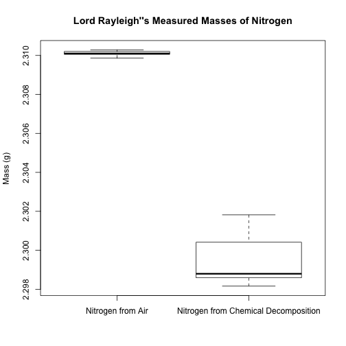

Argon - t-test
========================================================

http://chemicalstatistician.wordpress.com/2013/03/10/discovering-argon-with-the-2-sample-t-test/

##### Analyzing Lord Rayleigh's Data on Nitrogen and Discovering Argon with the 2-Sample t-Test
##### Written by Eric Cai - The Chemical Statistician


```r


atmospheric.nitrogen = c(2.31017, 2.30986, 2.3101, 2.31001, 2.31024, 2.3101, 
    2.31028, NA)
chemical.nitrogen = c(2.30143, 2.2989, 2.29816, 2.30182, 2.29869, 2.2994, 2.29849, 
    2.29869)
nitrogen.masses = data.frame(atmospheric.nitrogen, chemical.nitrogen)
colnames(nitrogen.masses) = c("Nitrogen from Air", "Nitrogen from Chemical Decomposition")
```


```r
boxplot(nitrogen.masses, main = "Lord Rayleigh''s Measured Masses of Nitrogen", 
    ylab = "Mass (g)")
```

 


## Do a 2 sample t-test
* Null Hypothesis: There is no difference between the masses of the 2 types of nitrogen.
* Alternative Hypothesis: There is a difference between the masses of the 2 types of nitrogen.

```r
t.test(atmospheric.nitrogen, chemical.nitrogen)
```

```
## 
## 	Welch Two Sample t-test
## 
## data:  atmospheric.nitrogen and chemical.nitrogen
## t = 21.52, df = 7.168, p-value = 8.919e-08
## alternative hypothesis: true difference in means is not equal to 0
## 95 percent confidence interval:
##  0.009495 0.011827
## sample estimates:
## mean of x mean of y 
##     2.310     2.299
```


Interpretation
* Low p-value indicates less evidence for null hypothesis
* p-value < 0.05, so reject null hypothesis - so, 2 samples of nitrogen are different!
